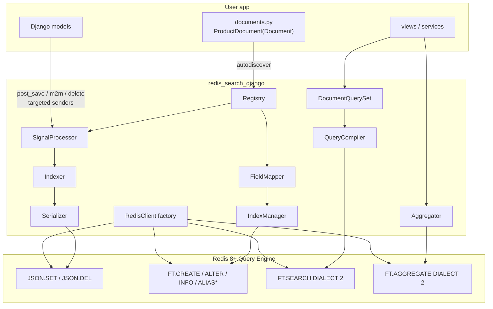
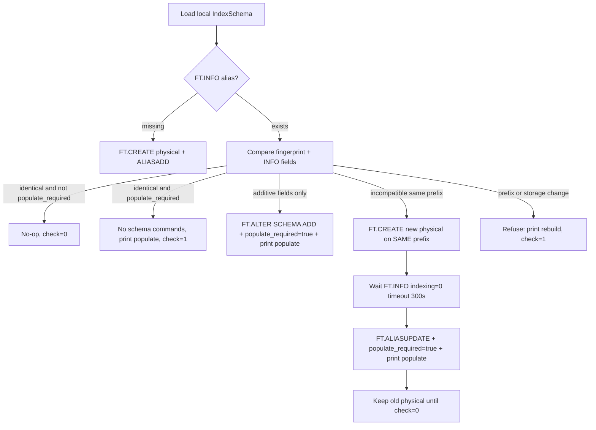
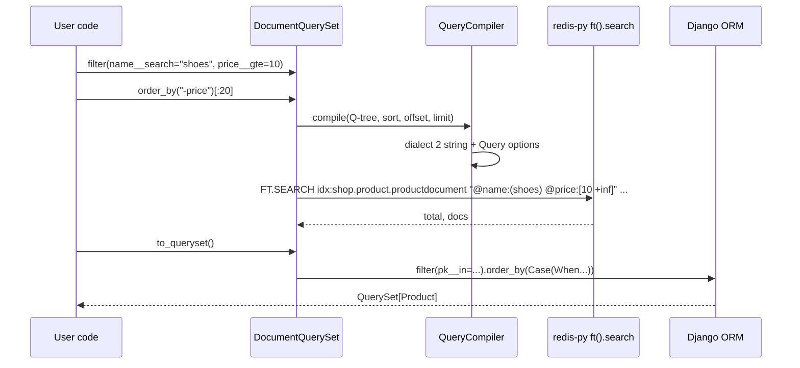
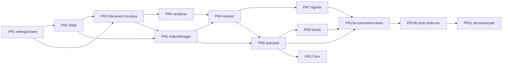

# redis-search-django 1.0: Modular RediSearch Integration

| Field | Value |
| --- | --- |
| **Title** | redis-search-django 1.0 — a breaking rewrite of indexing, sync, and query |
| **Author** | Maksudul Haque (maintainer) / design draft |
| **Date** | 2026-08-20 |
| **Status** | Draft |
| **Current version** | 0.2.0 |
| **Target version** | **1.0.0** |
| **Audience** | Maintainers and contributors of `redis-search-django` |

---

## Overview

`redis-search-django` 0.2.0 is a Django package that indexes model instances into Redis Query Engine (RediSearch) and exposes search, pagination, QuerySet conversion, and a bolted-on aggregation path. It does this by **subclassing redis-om `JsonModel`/`HashModel`**, injecting Django fields into Pydantic via a custom `DocumentMeta`, connecting **global** `post_save`/`pre_delete`/`post_delete`/`m2m_changed` handlers, and subclassing redis-om `FindQuery` so that a private `_model_cache` can be replaced with a Django-paginator-friendly result object.

That architecture has reached the end of its useful life. The 0.2.0 work (Pydantic v2, `SchemaDetector`, Python 3.10–3.14, Django 5.2/6.x) made the package runnable on current Redis, but it did not remove the hacks: `model_fields` mutation, `embedded=True` pk-stripping workarounds, Boolean-as-int, `FindQuery.execute()` reimplementation, and a single inheritance tree that mixes mapping, serialization, index lifecycle, sync, and query.

**1.0.0 is a clean break.** The package will talk to Redis Query Engine through **redis-py only**. Users will declare a small `Document` class (Django-form-like, familiar from 0.2.x and from django-elasticsearch-dsl). The library will infer schema, related-object fan-out, index names, prefixes, and signal wiring. Query will look like the Django ORM (`Document.objects.filter(name__search="shoes").order_by("-price")[:20]`), not redis-om expression operators. Facets will be a first-class `FT.AGGREGATE` API. Internals (serializer, field mapping, index manager, query compiler, signal processor, Redis connection) will be independently overridable.

This is **1.0.0**, not 2.0.0. 0.2.0 is still pre-1.0; 1.0.0 is the first stable public API. There is no 1.x compatibility surface to preserve, and we will not ship shims for redis-om models, `FindQuery`, or Pydantic `Field` annotations.

---

## Background & Motivation

### Current architecture (0.2.0)

The package is a thin, leaky adapter over redis-om 1.x:

```text
Django model save/delete
        │
        ▼
signals.py  ── global handlers on ALL senders ──► registry.py
        │                                              │
        ▼                                              ▼
 Document (redis-om JsonModel/HashModel via DocumentMeta)
        │
        ├─ config.py          Django field → redis-om Field (Boolean → int)
        ├─ query.py           RediSearchQuery(FindQuery) + _model_cache swap
        ├─ paginator.py       mutates FindQuery.offset/limit
        ├─ documents.aggregate  redis-py FT.AGGREGATE bolted on
        └─ management index   SchemaDetector().run() + registry.index_documents()
```

Concrete pain, with file citations:

| # | Hack | Where | Why it exists |
| --- | --- | --- | --- |
| 1 | Inherit redis-om models just to get `find()` and `FT.CREATE` | [`redis_search_django/documents.py`](redis_search_django/documents.py) `JsonDocument`/`HashDocument`/`EmbeddedJsonDocument` | redis-om owns index creation and query syntax |
| 2 | Metaclass injects Pydantic fields from `Django.fields` before model construction | `DocumentMeta.__new__` + `_inject_django_fields()` | redis-om 1.x is Pydantic v2; fields must exist at class-build time |
| 3 | Fight `embedded=True` pk stripping | `EmbeddedJsonDocument.pk` re-declaration + `@field_validator("pk")` no-op + `Meta.embedded = False` | redis-om strips `pk` on embedded models; Django related objects still need it |
| 4 | Global signals on every model | [`signals.py`](redis_search_django/signals.py) `post_save.connect(...)` with no `sender` | registry lookup after the fact |
| 5 | Subclass `FindQuery`, replace private `_model_cache` | [`query.py`](redis_search_django/query.py) `RediSearchQuery` | Django `Paginator` needs `count()` = hit total, not page length |
| 6 | Boolean stored as `int` | [`config.py`](redis_search_django/config.py) + `data_from_model_instance` | redis-om maps `bool` → NUMERIC ([redis-om#193](https://github.com/redis/redis-om-python/issues/193)) |
| 7 | One inheritance tree owns mapping, schema, sync, query | `Document` classmethods (`from_model_instance`, `index_queryset`, `find`, `aggregate`, `update_from_related_model_instance`) | no seams to override one concern |

### Why a rewrite now

- Redis 8 ships Query Engine + RedisJSON in-box. The runtime we target is stable: `ON JSON`, dialect 2, `FT.AGGREGATE`, `VECTOR`, `FT.ALIASADD`, `FT.INFO`.
- redis-om 1.x solved *Redis as a primary document store*. This package solves *Django as source of truth, Redis as a search index*. Those are different products. Forcing the first into the second is what produced the hacks.
- redis-om still does not own aggregations, vector fields as a designed-in Django mapping, index aliases, or schema-drift detection. We already drop to redis-py for facets; 1.0 should do that everywhere.
- Users should not need to know Pydantic, redis-om `Field(index=True, full_text_search=True)`, or `SchemaDetector`. They should declare a model + field list.

### What 0.2.0 already got right (keep the *ideas*)

- Document class in `documents.py`, autodiscovered by `AppConfig.ready()` — same shape as django-elasticsearch-dsl.
- `class Django:` options (`model`, `fields`, `auto_index`, `select_related_fields`, `prefetch_related_fields`, `related_models`).
- `prepare_{field}(obj)` and `get_queryset()` override hooks.
- Related-object reindex on FK / O2O / M2M change.
- `to_queryset()` that preserves RediSearch ranking via `Case(When(pk=..., then=position))`.
- Management command that can migrate schema and/or populate.
- Global kill-switch `REDIS_SEARCH_AUTO_INDEX`.

1.0 keeps those *user-visible ideas* and throws away the *implementation*.

---

## Goals & Non-Goals

### Goals

1. **Small, Django-idiomatic user API.** A searchable model is a `Document` subclass + field list. Related objects, schema, sync, and query building are automatic.
2. **Simplicity for package users, overridability for power users.** Defaults do the right thing. Every important seam (`get_queryset`, `prepare_*`, serializer, index name/prefix, Redis connection, signal processor, query compiler) is a documented hook.
3. **Modular internals.** Schema mapping, serializer, index manager, sync pipeline, query compiler, and Django integration are separate modules with explicit interfaces.
4. **RediSearch 2.0+ / Redis Query Engine first-class.** Default `ON JSON`. Dialect 2 on every `FT.SEARCH` / `FT.AGGREGATE`. Native TEXT / TAG / NUMERIC / GEO / VECTOR field types. Prefixes, aliases, `STOPWORDS`, `LANGUAGE`, `SCORE`. `FT.AGGREGATE` facets in the public API. `FT.INFO` + schema fingerprint for drift.
5. **Drop redis-om as a runtime dependency.** redis-py is the only Redis client.
6. **Targeted signals.** Connect only to registered models and their declared related models / M2M through tables. Design a `SignalProcessor` interface so Celery/async can land later without a second rewrite.
7. **Related-model reindex with inference.** Prefer Django `_meta` (`related_name`, `one_to_many` / `many_to_many`) over hand-written `{"related_name": "...", "many": True}` dicts.
8. **Query UX that feels like Django ORM**, with `to_queryset()` and stock Django `Paginator` support (no private redis-om hooks).
9. **Python 3.10–3.14, Django 5.2 / 6.0 / 6.1.** uv + Ruff. No system dependencies.

### Non-Goals (1.0)

- Preserving redis-om `find()`, `%` / `<<` operators, `JsonModel` inheritance, or `REDIS_OM_URL`.
- Being a generic Haystack-style multi-backend search framework (Solr / ES / Whoosh). Redis Query Engine only.
- Using Redis as a primary data store or replacing the Django ORM.
- Implementing hybrid / KNN vector search or `__geo_distance` in the first mergeable PRs. **Field types** (`Vector`, `Geo`) emit `FT.CREATE`; `knn()` / `__geo_distance` are `NotImplementedError` (K27).
- Requiring Celery, django-rq, or any task queue. `BaseSignalProcessor` is the extension point; no in-tree Celery class (K28).
- Multi-index search in one query (Haystack `SearchQuerySet` across models). Users run per-document queries.
- Automatic zero-downtime schema migration for *incompatible* field-type changes without a rebuild. We will detect drift and provide an alias-swap rebuild; we will not invent an online ALTER-type for RediSearch.
- Cluster-aware hash-tag routing beyond documenting that prefixes should include `{hashtag}` if the user is on Redis Cluster.
- A new first-party web UI.

---

## Key Decisions

| # | Decision | Rationale |
| --- | --- | --- |
| K1 | **Version 1.0.0** (not 2.0.0) | 0.2.0 is pre-1.0. This is the first stable API. Semver 2.0.0 would imply a 1.x we never shipped. |
| K2 | **Drop redis-om at runtime.** Depend on `django>=5.2` and `redis>=5.0` (recommend `redis>=6` so client default dialect is 2). 1.0 *is* the thin redis-py layer: we emit `IndexDefinition` / typed fields / `Query` / `AggregateRequest` ourselves. redis-om cannot be that layer without Pydantic models in the Document MRO. | redis-om is a Pydantic OM for Redis-as-DB. It is the source of every listed hack. redis-py already exposes the commands we need. |
| K3 | **Do not depend on redisvl.** | redisvl is an AI/vector toolkit (YAML schema, `VectorQuery`, embedding helpers). We would take a vector-centric abstraction and still have to invent Django mapping, signals, and QuerySet bridging. We can speak the same Redis commands redisvl wraps. |
| K4 | **One `Document` class.** Storage (`json` default, `hash` opt-in) is an `Index` option. Nested data is `Object` / `Nested` fields, not `EmbeddedJsonDocument` inheritance. | Three-class hierarchy existed only because redis-om has `JsonModel` / `HashModel` / `EmbeddedJsonModel`. |
| K5 | **User declaration stays Document-shaped** (`class Django`, `fields = [...]`, `prepare_*`), closest to django-elasticsearch-dsl. | Users of 0.2.x and of ES-DSL already know this. A model mixin (django-meili / django-typesense) pollutes the ORM. Haystack’s `search_indexes.py` + `document=True` is extra ceremony we do not need for a single backend. |
| K6 | **Query API is Django lookups on `Document.objects`**, not redis-om operators and not raw redis-py `Query("...")` as the primary path. `order_by` accepts **one** field in 1.0 (`NotSupportedError` on extras). | `name__search`, `price__gte`, `tags__name__in` is what Django engineers already write. `FT.SEARCH SORTBY` is single-attribute; multi-field sort is `FT.AGGREGATE`-only and is a later PR. |
| K7 | **Boolean is TAG `"true"`/`"false"`.** JSON storage keeps a JSON bool; Hash storage writes the strings `"true"`/`"false"` (Redis Hash cannot store a JSON bool). | RediSearch has no BOOLEAN type. TAG is the correct exact-match enum. The int hack dies with redis-om. |
| K8 | **Default storage is `ON JSON`.** Hash is explicit `class Index: storage = "hash"` and forbids nested fields. | JSON is required for vendor/tags/category embeddings. Redis 8 includes RedisJSON. |
| K9 | **Dialect 2 on every search/aggregate.** | Required for VECTOR, consistent numeric operators (`@price>=10`), and the query-parser fixes Redis documents as the non-deprecated dialect family. redis-py 6 already sends it; we set it explicitly for redis-py 5. |
| K10 | **Signals connect per registered sender**, via a swappable `SignalProcessor`. | Stops the global-handler scan. Matches django-elasticsearch-dsl’s `ELASTICSEARCH_DSL_SIGNAL_PROCESSOR`. Celery is a later processor, not a v1 dependency. |
| K11 | **Related-model config is inferred from `Object`/`Nested` `model_attr`.** `related_models=None` infers all. `{}` disables related signals. A **non-empty dict merges**: listed models replace inference; unlisted `Object`/`Nested` still infer. Ambiguous graphs raise at register time. | Merge means a Vendor-only dict does not silently drop Category/Tag fan-out. |
| K12 | **Stock Django `Paginator` works.** `DocumentQuerySet` is lazy: `count()`/`__len__` = `LIMIT 0 0` total; `__bool__`/`exists()` = `LIMIT 0 1`; slice/index compile `LIMIT`; unsliced iteration pages at `CHUNK_SIZE`. `RediSearchPaginator` is deleted. | The custom paginator existed solely to poke `FindQuery.paginate()`. |
| K13 | **Schema identity is a fingerprint + `FT.INFO`.** Additive fields use `FT.ALTER SCHEMA ADD`. Incompatible changes create a versioned physical index and `FT.ALIASUPDATE` the stable alias. `update` never silently rewrites documents; it prints the required follow-up (`populate` / `rebuild`). | RediSearch cannot change field types in place. `FT.ALTER` / same-prefix rescan do not run the serializer. |
| K14 | **No Pydantic in the hot path.** Documents serialize to plain `dict`s. Search hits are small dataclasses. | Removes the metaclass/field-injection war. Validation of *Django* data is Django’s job. |
| K15 | **Keep `to_queryset()` order-preserving `Case`/`When`.** Warn (and optionally refuse) above `TO_QUERYSET_WARN = 1000` pks. Unslized `to_queryset()` is an explicit footgun. | Proven in 0.2.0. A 10k-id `Case` blows up SQL. |
| K16 | **Default alias/prefix include the Document class name.** `idx:{app}.{model}.{document}` / `{PREFIX}:{app}.{model}.{document}:`. Two non-embedded Documents must not share an alias or a prefix (`ImproperlyConfigured` at register). | Two Documents per model is supported ([`tests/test_registry.py`](tests/test_registry.py)). 0.2.x prefixes by redis-om class; model-only defaults would collide. |
| K17 | **`order_by` is single-field in 1.0.** Extra fields raise `NotSupportedError`. The name is resolved through the flattening table and must be a **SORTABLE** alias (`FieldError` otherwise). Multi-field sort via `FT.AGGREGATE` is out of 1.0. | `FT.SEARCH SORTBY` accepts one attribute and errors on missing/non-sortable fields. |
| K18 | **Realtime writes use `transaction.on_commit` when `in_atomic_block`, else write immediately.** | `JSON.SET` inside `atomic()` would leave Redis ahead of Django on rollback. After commit, Redis errors cannot roll back the row. |
| K19 | **`SIGNAL_ERRORS`** is `"raise"` (default) or `"log"`. **Outside** `atomic()`: Redis errors raise out of `save()`/`delete()`. **Inside** `atomic()`: the hook runs **after commit** — a raised Redis error can 500 the request but **does not** undo the DB row; `redisearch populate` heals. `"log"` never 500s after a successful commit. | Do not claim Redis-index writes are atomic with `Model.save()`. |
| K20 | **`redisearch update` migrates schema only.** **Any additive field** is outcome 2: `populate_required=true`, `check` exits 1 until `populate` writes `populated_fp`. Alias-swap and prefix/storage change also require populate/rebuild. `update` never populates. | `FT.ALTER` does not rewrite JSON. Overlapping “optional vs required populate” rules are not implementable. |
| K21 | **Only `redis_search_django.Q`.** Passing `django.db.models.Q` is a `TypeError`. | Django `Q` accepts ORM lookups (`__icontains`, `__year`) that we do not implement. One `Q` type is a single source of truth. |
| K22 | **Date/datetime JSON is unix timestamp float, UTC.** Aware → `timezone.localtime` then UTC epoch; naive treated as UTC. `DateField` → midnight UTC of that date. `prepare_*` may emit another shape. | One path for JSON and NUMERIC. ISO is a `prepare_*` override, not the default. |
| K23 | **`objects.search(q)` uses `Index.search_fields` if set, else every TEXT field** as `@name\|description:(...)`. | Restricted is more predictable; default-all-TEXT matches “hide the engine.” |
| K24 | **Facet / `group_by` arguments are Django lookups** (`category__name`, `tags__name`). Compiler maps them to `AS` aliases. | Users must not learn `category_name` vs `category__name`. |
| K25 | **redis-py client uses `decode_responses=True`.** VECTOR bytes are encoded as hex/list by the Vector field on write and never returned via `decode_responses` search in 1.0 (`knn()` is a follow-up). | Matches the CONNECTION example and JSON document strings. Avoid mixed bytes/str in `FT.SEARCH` parsing. |
| K26 | **Bulk ORM (`QuerySet.update` / `bulk_create` / `bulk_update` / `QuerySet.delete`) is unsupported.** Document it; point at `redisearch populate`. No QuerySet monkeypatch in 1.0. | Those paths do not fire `post_save`. Typesense-style manager overrides are a later PR. |
| K27 | **Geo and `knn()` are 1.0 non-goals except schema emission.** `Geo` / `Vector.to_redis_field()` exist so `FT.CREATE` is complete; `__geo_distance` and `knn()` raise `NotImplementedError`. No default Django `PointField` mapping. | Keeps PR 2 honest without shipping an unfinished query API. |
| K28 | **Celery processor is docs-only in 1.0.** `BaseSignalProcessor` is the extension point. No in-tree Celery import. | Avoids an optional extra and a half-tested class. Users copy ~15 lines. |
| K29 | **Composite primary keys are rejected** (`ImproperlyConfigured`). `pk = str(instance.pk)` assumes a single atomic PK. | Django 5.2 composite PKs have no defined Redis key. |

---

## Proposed Design

### High-level architecture



### Package layout (target)

```text
redis_search_django/
  __init__.py              # public: Document, fields, Q, registry, get_redis_connection
  apps.py                  # autodiscover documents + start SignalProcessor
  conf.py                  # REDIS_SEARCH settings, typed accessors
  exceptions.py            # ImproperlyConfigured wrappers, SchemaDrift, DocumentNotFound
  client.py                # connection factory (overridable)
  documents.py             # Document + DocumentMeta + DocumentOptions (no Pydantic)
  fields.py                # Text, Tag, Numeric, Geo, Vector, Boolean, Object, Nested
  mapping.py               # Django field class → default Field
  schema.py                # Schema, fingerprint, redis-py Field builders
  serializer.py            # model instance → JSON/Hash dict
  index.py                 # IndexManager: create / alter / drop / alias / info / migrate
  indexer.py               # bulk + incremental upsert/delete
  registry.py              # model ↔ documents, related-model reverse map
  signals.py               # RealtimeSignalProcessor + BaseSignalProcessor
  query/
    __init__.py
    lookups.py             # lookup registry
    compiler.py            # Q-tree → dialect-2 string
    queryset.py            # DocumentQuerySet / DocumentManager
    results.py             # SearchResult, SearchHit
    aggregate.py           # FacetRequest / aggregate helpers
  views.py                 # SearchListView mixin (thin)
  management/commands/
    redisearch.py          # create / rebuild / update / populate / drop / info
```

`mixins.py` is renamed to `views.py`. `config.py` becomes `mapping.py` (data) + `conf.py` (settings). There is no `query.py` mega-file.

### 1. Document declaration (user-facing, thin)

`Document` is a **declarative mapping class**, analogous to `django.forms.ModelForm` and `django_elasticsearch_dsl.Document`. It is **not** a Redis row, **not** a Pydantic model, and **not** a Django model.

```python
# redis_search_django/documents.py (sketch)

class DocumentMeta(type):
    def __new__(mcs, name, bases, attrs):
        declared = {
            key: attrs.pop(key)
            for key, value in list(attrs.items())
            if isinstance(value, Field)
        }
        cls = super().__new__(mcs, name, bases, attrs)
        cls._meta = DocumentOptions(cls, bases, declared)
        if not cls._meta.abstract and not cls._meta.embedded:
            document_registry.register(cls)
        return cls


class Document(metaclass=DocumentMeta):
    # PR 3: unset descriptor. PR 8: DocumentManager that returns DocumentQuerySet.
    objects: ClassVar[DocumentManager]

    @classmethod
    def get_queryset(cls) -> QuerySet: ...
    @classmethod
    def should_index(cls, instance: Model) -> bool: ...  # default True
    @classmethod
    def get_instances_from_related(cls, related: Model) -> QuerySet | Model | None: ...
    @classmethod
    def prepare(cls, instance: Model) -> dict[str, Any]: ...  # post-coercion replacement
    # plus prepare_{field}(instance) per field
```

#### Normative `class Django` options

| Option | Type | Default | Meaning |
| --- | --- | --- | --- |
| `model` | `type[Model]` | required unless `abstract=True` | Django model this Document indexes |
| `fields` | `Sequence[str]` | `()` | Model fields auto-mapped via `mapping.py`. Related fields (`FK`/`O2O`/`M2M`) are **rejected** here — use `Object`/`Nested`. |
| `auto_index` | `bool` | `True` | Connect realtime signals for this Document |
| `select_related_fields` | `Sequence[str]` | `()` | Applied in `get_queryset()` and in related-reindex querysets |
| `prefetch_related_fields` | `Sequence[str]` | `()` | Same |
| `related_models` | `None \| dict` | `None` | `None` = infer all (K11). `{}` = **no related signals**. Non-empty `dict[Model, {related_name, many}]` = **merge**: those models replace inference; unlisted `Object`/`Nested` still infer. A `list` is **not** accepted. |
| `embedded` | `bool` | `False` | No Redis index, no primary signals; only used as `Object`/`Nested` target |
| `abstract` | `bool` | `False` | Contribute fields to subclasses; not registered |

#### Normative `class Index` options

| Option | Type | Default | Meaning |
| --- | --- | --- | --- |
| `name` | `str \| None` | `idx:{app}.{model}.{document}` | Stable **alias** (K16) |
| `prefix` | `str \| None` | `{PREFIX}:{app}.{model}.{document}:` | Redis key prefix, including trailing `:` |
| `storage` | `"json" \| "hash"` | `"json"` | `ON JSON` vs `ON HASH` |
| `language` | `str \| None` | `None` (Redis default English) | `FT.CREATE LANGUAGE` |
| `stopwords` | `Sequence[str] \| None` | `None` | `None` = Redis default list; `()` = `STOPWORDS 0` |
| `score` | `float` | `1.0` | `FT.CREATE SCORE` |
| `dialect` | `int` | `2` | Forced on every `FT.SEARCH` / `FT.AGGREGATE` |
| `search_fields` | `Sequence[str]` | all TEXT fields | Fields `objects.search()` queries (K23) |

`app` is `model._meta.app_label`, `model` is `model._meta.model_name`, `document` is the Document class name lowercased (`ProductDocument` → `productdocument`). Users who want a prettier alias set `Index.name` / `Index.prefix` explicitly.

**Registry uniqueness (register time):** `(alias, prefix)` must be unique across non-embedded Documents. Two Documents on the same model with default names do **not** collide (`idx:shop.product.productdocument` vs `idx:shop.product.productlightdocument`). Sharing a prefix is always `ImproperlyConfigured` — incremental `JSON.SET` would overwrite the sibling.

**Field inheritance** (Django `ModelForm.Meta` style): walk MRO left-to-right. Abstract bases contribute declared `Field`s and `Django.fields`. A subclass attribute of the same name overrides. Concrete (non-abstract, non-embedded) subclass must have `model` set on itself or an abstract base. An abstract base may omit `model`.

`DocumentMeta` **collects** `Field` instances and Django options. It does **not** mutate another library’s model class. Registration is an explicit `registry.register` call from the metaclass, only for non-abstract, non-embedded classes that own an index.

**Embedded / nested documents** are ordinary `Document` subclasses with `class Django: embedded = True` (or used only as the target of `Object`/`Nested`). They are **not** registered as top-level indexes and do not receive signals as primary documents.

### 2. Field type system

```python
# redis_search_django/fields.py (sketch)

@dataclass(kw_only=True)
class Field:
    name: str | None = None          # set by metaclass
    model_attr: str | None = None    # dotted path; default = name
    sortable: bool = False
    no_index: bool = False
    index_missing: bool = False
    weight: float | None = None      # TEXT
    no_stem: bool = False
    phonetic: str | None = None

    def redis_type(self) -> str: ...
    def json_path(self) -> str: ...          # $.name or $.tags[*].name
    def as_name(self) -> str: ...            # RediSearch attribute alias
    def to_redis_field(self) -> RedisField:  # redis.commands.search.field.*
    def to_index_value(self, raw: Any) -> Any: ...
    def prepare(self, instance: Model, document_cls: type[Document]) -> Any: ...


class Text(Field):      # FT TEXT
class Tag(Field):       # FT TAG (separator, case_sensitive, suffix_trie)
class Numeric(Field):   # FT NUMERIC
class Boolean(Field):   # TAG, values "true"/"false"; JSON bool stored
class Geo(Field):       # "lon,lat"
class Vector(Field):
    # 1.0 emits FT.CREATE VECTOR; knn() is NotImplementedError (K27)
    dims: int
    algorithm: Literal["FLAT", "HNSW"] = "HNSW"
    distance: Literal["COSINE", "L2", "IP"] = "COSINE"
    type: Literal["FLOAT32", "FLOAT64"] = "FLOAT32"
    m: int = 16                    # HNSW M
    ef_construction: int = 200     # HNSW EF_CONSTRUCTION
    ef_runtime: int = 10           # HNSW EF_RUNTIME
    initial_cap: int | None = None # FLAT INITIAL_CAP
class Object(Field):
    """1.0 constructor: Object(OtherDocument, *, required=True, model_attr=None)."""
class Nested(Field):
    """1.0 constructor: Nested(OtherDocument, *, model_attr=None)."""
```

`Object` / `Nested` take a **Document class only**. There is no `(model, fields)` tuple form and no `Object.from_model(...)` in 1.0. The target Document’s `Django.model` is the related model for inference (step 5a). `prepare_*` methods live on that target Document and run when the nested payload is serialized.

`Vector.to_redis_field()` maps to redis-py `VectorField(json_path, algorithm, {"TYPE", "DIM", "DISTANCE_METRIC", ...})` so PR 2 can emit a valid `FT.CREATE`. `knn()` stays `NotImplementedError` until PR 12. `Geo.to_redis_field()` exists; `__geo_distance` is `NotImplementedError`. No default mapping from `django.contrib.gis.PointField`.

Default Django → Field mapping ([`mapping.py`](redis_search_django/mapping.py), replaces [`config.py`](redis_search_django/config.py)):

| Django field | Default 1.0 Field | RediSearch | Stored JSON |
| --- | --- | --- | --- |
| `CharField`, `TextField`, `EmailField` | `Text` (`sortable=True` for `CharField` with `max_length<=256`) | TEXT | string |
| `SlugField`, `UUIDField`, `URLField` | `Tag` | TAG | string |
| `Integer*`, `AutoField*`, `FloatField`, `DecimalField` | `Numeric(sortable=True)` | NUMERIC | number (`Decimal` → `float`) |
| `DateField`, `DateTimeField` | `Numeric(sortable=True)` | NUMERIC (unix ts, UTC) | unix timestamp `float` (K22). `prepare_*` may emit ISO. |
| `TimeField` | `Tag` | TAG (`HH:MM:SS`) | string |
| `BooleanField` | `Boolean` | TAG `{true\|false}` | JSON `true`/`false`; Hash `"true"`/`"false"` (K7) |
| `FileField`, `ImageField` | `Tag` | TAG | `FieldFile.name` (storage path). Use `prepare_*` for `.url`. |
| `FilePathField` | `Tag` | TAG | string path |
| `ForeignKey`, `OneToOneField` | **not auto-mapped** | must be `Object(...)` | object or `null` |
| `ManyToManyField` | **not auto-mapped** | must be `Nested(...)` | array |

Users override a default by declaring the field explicitly:

```python
slug = fields.Text(sortable=False, no_stem=True)  # was Tag by default
available = fields.Numeric()  # if someone really wants 0/1
```

### 3. Schema & IndexManager

An `IndexSchema` is a pure data object:

```python
@dataclass(frozen=True)
class IndexSchema:
    alias: str                 # idx:shop.product.productdocument
    physical_name: str         # idx:shop.product.productdocument:a1b2c3d4
    prefix: str                # rsd:shop.product.productdocument:
    storage: Literal["json", "hash"]
    language: str | None
    stopwords: tuple[str, ...] | None
    score: float
    fields: tuple[SchemaField, ...]

    def fingerprint(self) -> str:
        """sha256 hex[:16] of the canonical JSON document below."""
```

**Fingerprint canonicalization (byte-stable):** UTF-8 JSON, `sort_keys=True`, no whitespace, schema version prefix `rsd-schema-v1`. Payload:

```json
{
  "v": 1,
  "storage": "json",
  "prefix": "rsd:shop.product.productdocument:",
  "language": null,
  "stopwords": null,
  "score": 1.0,
  "fields": [
    {"name": "available", "type": "TAG", "path": "$.available", "alias": "available", "sortable": false, "index_missing": true},
    {"name": "name", "type": "TEXT", "path": "$.name", "alias": "name", "sortable": true, "weight": 1.0}
  ]
}
```

`fields` is sorted by `name`. Only attributes that change `FT.CREATE` / serializer output are included (`sortable`, `no_index`, `index_missing`, `weight`, `no_stem`, `phonetic`, TAG `separator`/`case_sensitive`/`suffix_trie`, Vector `dims`/`algorithm`/`distance`/`type`/`m`/`ef_*`). Adding a library-only helper that does not change SCHEMA must not change the hash. Physical index name = `{alias}:{fingerprint[:8]}`.

**Lookup name → JSON path → `AS` alias → Hash name** (flattening is not configurable in 1.0):

| User lookup / facet arg | JSON path | RediSearch `AS` alias | Hash field |
| --- | --- | --- | --- |
| `pk` | `$.pk` | `pk` | `pk` |
| `name` | `$.name` | `name` | `name` |
| `vendor__name` | `$.vendor.name` | `vendor_name` | `vendor__name` (Hash forbids nested lists; nested *objects* flatten with `__`) |
| `category__name` | `$.category.name` | `category_name` | `category__name` |
| `tags__name` | `$.tags[*].name` | `tags_name` | illegal on Hash (`ImproperlyConfigured`) |

Collision: a concrete field named `category_name` and an `Object` field `category` with child `name` both want alias `category_name`. **Register-time `ImproperlyConfigured`.** Users rename with `fields.Text(as_name="...")` or `Object(..., prefix="cat")` if we need an escape; 1.0 escape is `as_name` on the child Field.

`index_missing` default: **`True` only when the Django source is `null=True`**, and for `Object(..., required=False)`. **`blank=True` alone does not set it** (`CharField(blank=True)` still stores `""`). `__isnull` means **JSON path absent** (`ismissing(@field)`), not Django `blank`. Empty-string filtering is a TAG/TEXT query (`name__exact=""`). `__isnull` on a field without `INDEXMISSING` raises `ImproperlyConfigured` at compile time.

`IndexManager` is the only module that issues index-admin commands:

| Method | Redis |
| --- | --- |
| `create()` | `FT.CREATE` `ON JSON\|HASH` `PREFIX 1 {prefix}` `SCHEMA ...` then `FT.ALIASADD` (or `ALIASUPDATE`) |
| `alter_add(fields)` | `FT.ALTER` `SCHEMA ADD` |
| `drop(delete_docs=False)` | `FT.DROPINDEX` [`DD`] |
| `info()` | `FT.INFO` |
| `exists()` | `FT.INFO` / catch `Unknown index` |
| `drift()` | compare fingerprint key `rsd:meta:{alias}` + `FT.INFO` attributes vs local schema |
| `migrate()` | see below |
| `alias_update(physical)` | `FT.ALIASUPDATE` `{alias}` `{physical}` |

**JSON schema example** for `ProductDocument`:

```text
FT.CREATE idx:shop.product.productdocument:a1b2c3d4
  ON JSON
  PREFIX 1 rsd:shop.product.productdocument:
  LANGUAGE english
  SCHEMA
    $.pk               AS pk              TAG SORTABLE
    $.name             AS name            TEXT SORTABLE WEIGHT 1.0
    $.description      AS description     TEXT
    $.price            AS price           NUMERIC SORTABLE
    $.available        AS available       TAG
    $.created_at       AS created_at      NUMERIC SORTABLE
    $.vendor.name      AS vendor_name     TEXT SORTABLE
    $.vendor.pk        AS vendor_pk       TAG
    $.category.name    AS category_name   TAG
    $.category.pk      AS category_pk     TAG
    $.tags[*].name     AS tags_name       TAG
    $.tags[*].pk       AS tags_pk         TAG
```

`FT.CREATE` kwargs via redis-py: `IndexDefinition(prefix=[prefix], index_type=IndexType.JSON|HASH, language=..., score=..., stopwords=list|tuple)`. `TextField(..., weight=, no_stem=, phonetic=, sortable=)`. `TagField(..., separator=, case_sensitive=)`. Empty stopwords → `stopwords=[]` (redis-py emits `STOPWORDS 0`).

Nested object fields flatten to `AS` aliases with `_` as in the table above. Lookups and `facets()` take Django names (`category__name`); the compiler emits `@category_name`.

**Migration outcomes** (`IndexManager.migrate` / `redisearch update`):

| Outcome | When (first match wins) | Redis | Documents | Follow-up | `check` exit |
| --- | --- | --- | --- | --- | --- |
| 1. no-op | fingerprint + `FT.INFO` match **and** `populate_required` is false | none | unchanged | none | 0 |
| 1b. waiting on populate | fingerprint + `FT.INFO` match **and** `populate_required` is still true | **none** (do not ALTER again) | still holes / stale shape | print `populate` | 1 until `populated_fp == fingerprint` |
| 2. ALTER + required populate | schema differs **only** by newly added fields | `FT.ALTER SCHEMA ADD`; set `populate_required=true` | old keys lack the new path until `JSON.SET` | **`populate` required** | 1 until `populated_fp == fingerprint` |
| 3. alias-swap + required populate | type change, path change, field removed, language/stopwords/score change | `FT.CREATE` new physical on **same prefix**, wait `indexing=0`, `ALIASUPDATE`; set `populate_required=true` | rescan sees **current** JSON; serializer/path/type changes are wrong until populate | **`populate` required** | 1 until populate |
| 4. rebuild | prefix change or storage json↔hash | `update` **refuses** (prints `rebuild`) | must rewrite | **`rebuild`** | 1 until rebuild |

**Mechanical rule:** any additive field → outcome 2. There is no “optional populate / check passes with holes” path. `redisearch check` exits 1 iff `drift()` is true **or** `populate_required` is true and `populated_fp != fingerprint`.

`redisearch update` **never** runs populate (K20). It prints the outcome and the exact next command (`populate` or `rebuild`). Dual physical indexes on the same prefix **both ingest** incremental `JSON.SET` (RediSearch indexes every matching prefix). Peak memory is ~2× inverted-index size until `DROPINDEX` of the old physical — see Risks.



Wait loop: poll `FT.INFO` `indexing` every 200 ms, timeout 300 s, then abort without `ALIASUPDATE`.

Fingerprint Redis key: `{PREFIX}:meta:{alias}` → JSON `{fingerprint, physical_name, created_at, populate_required, populated_fp}`.

### 4. Serializer

`Serializer.to_document(document_cls, instance, *, exclude=None) -> dict`.

Algorithm (replaces `Document.data_from_model_instance`):

1. If `len(instance._meta.pk_fields) != 1` (Django 5.2+ composite / `CompositePrimaryKey`), raise `ImproperlyConfigured` (K29). Confirm `opts.pk_fields` against Django 5.2 in PR 4.
2. Always include `pk = str(instance.pk)`.
3. For each concrete field:
   - If `prepare_{name}` exists on the Document class, call it (raw Python value).
   - Else if `Field.model_attr` is dotted (`vendor.name`), walk attributes.
   - Else `getattr(instance, field.model_attr or field.name)`.
   - `Object`: recurse into the target Document serializer (or `None`).
   - `Nested`: iterate `all()`, recurse, skip `exclude`.
4. Run `Field.to_index_value` on every leaf (including `prepare_*` results):
   - `bool` → JSON bool; Hash → `"true"` / `"false"` (K7).
   - `datetime` aware → `timezone.localtime(dt).astimezone(datetime.timezone.utc).timestamp()` (float). Naive → treated as UTC (K22).
   - `date` → midnight UTC of that date as float timestamp.
   - `Decimal` → `float`.
   - `FieldFile` / `ImageField` file → `.name` (storage path). `None` if no file. Use `prepare_logo` for `.url` (as today’s example already does).
   - `UUID` → `str`.
5. If `Document.prepare` is overridden, it runs **after** step 4 and **replaces the whole dict**. The user is responsible for coercions (`pk` as `str`, timestamps as float, Hash-safe bools). This is the escape hatch, not a hook that is re-coerced.

Hash storage: flatten with `__` (`vendor__name`). Nested lists (`Nested`) are rejected at schema-build time.

Writes:

```python
# JSON
client.json().set(key, Path.root_path(), payload)
# delete
client.delete(key)
# Hash
client.hset(key, mapping=flat)
```

Key format: `{prefix}{pk}` e.g. `rsd:shop.product.productdocument:42`.

Bulk writes use a Redis pipeline, `chunk_size` default **2000** (same as today’s `queryset.iterator(chunk_size=2000)`).

### 5. Sync pipeline

```python
class Indexer:
    def upsert(self, document_cls, instance: Model) -> None: ...
    def delete(self, document_cls, pk: Any) -> None: ...
    def upsert_queryset(self, document_cls, qs: QuerySet) -> int: ...
    def rebuild(self, document_cls) -> int:
        """Optional: SCAN+DEL prefix, then upsert_queryset(get_queryset())."""
    def reindex_related(self, document_cls, related: Model, *, exclude=None) -> None: ...
```

`Indexer` is what signal handlers and the management command call. It is **not** a method soup on `Document`. `Document.index_all()` becomes a one-liner facade for users who want it.

**Bulk vs incremental (normative):**

| Path | Filter |
| --- | --- |
| `redisearch populate` / `rebuild` / `index_all` | `get_queryset()` only (already applies `select_related` / `prefetch_related`) |
| Realtime `post_save` / `m2m_changed` on the **primary** model | `should_index(instance)` (default `True`). If `False`, **delete** the Redis key so stale docs do not linger. |
| Related-object fan-out | `get_instances_from_related` then `should_index` per parent. Related querysets apply the Document’s `select_related_fields` / `prefetch_related_fields` to avoid N+1. |

This is the 0.2.0 footgun: [`from_model_instance`](redis_search_django/documents.py) does not consult `get_queryset()`, so `ProductDocument.get_queryset().filter(available=True)` still indexes unavailable products on save. 1.0 makes `should_index` the incremental counterpart and puts it on the primary Product example.

### Related-object inference (deterministic)

Run **once at `document_registry.register()`** (metaclass), so `related_django_model_map` exists before `SignalProcessor.setup()`. Never infer at signal time.

**Algorithm**

1. If the user overrode `get_instances_from_related`, still populate the reverse map so signals fire; the override is used only to *resolve* parents.
2. If `Django.related_models is None` (default): infer.
3. If `Django.related_models == {}`: **no related signals**, even if `Object`/`Nested` exist. Primary-model signals still run.
4. If `Django.related_models` is a non-empty dict: **merge**. For each listed model, use `{"related_name": str, "many": bool}` and **do not infer** that model. Unknown keys → `ImproperlyConfigured`. Then run step 5 for every `Object`/`Nested` whose related model is **not** in the dict.
5. Inference (`related_models is None`, or unlisted models in a merge):
   a. Collect `Object`/`Nested` fields whose related model is not already in the resolved map. Each field’s target is `OtherDocument.Django.model` (1.0 constructor is `Object(OtherDocument)` / `Nested(OtherDocument)` only). `source_attr = field.model_attr or field.name`. Resolve `source_attr` against `model._meta.get_field`. The reverse accessor is `remote_field.get_accessor_name()`. `many` is `True` iff the forward field is `ManyToManyField` or the reverse is `one_to_many` / `many_to_many`.
   b. Do **not** scan every `_meta.get_fields()` relation. Only relations that appear in the serialized document (`Object`/`Nested` or a `model_attr` that walks onto another model) are candidates. A `Category.tags` M2M that is not in `ProductDocument` is ignored.
   c. **Ambiguity:** two `Object`/`Nested` fields to the same model with different accessors (`created_by` + `updated_by`) → `ImproperlyConfigured` listing both accessors. Fix with `related_models={User: {...}}` (merge: Category/Tag still infer) **or** `get_instances_from_related` returning the union. A dict entry for `User` does **not** require re-listing every other relation.
   d. Self-FK: treated as a normal FK (`Object`). Reverse accessor is inferred. Recursion in serialize is one level (the related Document’s fields), never walk `self` as nested `Object` of the same Document class (`ImproperlyConfigured`).
   e. Generic FK / `GenericRelation`: **not inferred**. Require `get_instances_from_related` + explicit `related_models`.
   f. Multi-table inheritance: the concrete child is the Document `model`. Parent-link auto-fields are not related models. Proxy models: register against `model._meta.concrete_model`; signals connect to the concrete class (Django sends the concrete sender).
6. `m2m_changed` is connected on the `through` table of **every M2M that appears in the serialized document** (`Nested` / `model_attr`) **and** whose related model is in the **resolved** related map (step 4 dict overrides ∪ step 5 inference). Dict-overridden M2Ms (e.g. a kept 0.2.x `Tag` entry) **are** connected. `related_models={}` still disables **all** related connections, including through tables. Embedded Documents do not get their own M2M connections unless a parent Document’s resolved map includes that M2M.

**CASCADE (1.0 — do not copy 0.2.0):**

0.2.0 [`update_from_related_model_instance`](redis_search_django/documents.py) comment says “skip re-indexing” on `many=False` + `on_delete==CASCADE`, but the body sets `exclude = None` and **still** `from_model_instance(..., save=True)`. For `Vendor → Product` CASCADE that upserts a parent `post_delete` will immediately remove. 1.0:

- If deleting `related` will **CASCADE-delete the parent** (`on_delete=CASCADE` on the parent’s FK/O2O to `related`, or a parent M2M is not involved): **do not upsert** the parent. Rely on the parent’s `post_delete` → `Indexer.delete`.
- If `on_delete=SET_NULL` / `SET_DEFAULT` / `PROTECT` / `RESTRICT`: upsert the parent with `exclude=related` so the serialized `Object` is `None` (or the `Nested` list omits it).
- `PROTECT`/`RESTRICT` will raise in Django before our `pre_delete` finishes; we still no-op the upsert if we cannot resolve parents.

**Inference cases (normative fixtures for PR 7):**

| Graph | Accessor | `many` | Delete related |
| --- | --- | --- | --- |
| `Product.vendor` O2O `CASCADE` | `vendor.product` | `False` | do **not** upsert Product; `post_delete` on Product deletes the doc |
| `Product.category` FK `SET_NULL` | `category.product_set` | `True` | upsert each Product with `category=None` |
| `Product.tags` M2M | `tag.product_set` | `True` | upsert each Product with that tag omitted (`exclude=tag`) |
| Two FKs to `User` (`created_by`, `updated_by`) | — | — | `ImproperlyConfigured` at register; `related_models={User: {...}}` **merges** (other relations still infer) and/or `get_instances_from_related` |
| Keep 0.2 dict verbatim (`Vendor`/`Category`/`Tag`) | `tag.product_set` | `True` | **`m2m_changed` is connected to `Product.tags.through`** (resolved map, not step 5a only). `product.tags.add()` reindexes. |

### 6. Signals (targeted)

```python
class BaseSignalProcessor:
    def setup(self, registry: DocumentRegistry) -> None: ...
    def teardown(self) -> None: ...
    def handle_save(self, sender, instance, **kwargs) -> None: ...
    def handle_delete(self, sender, instance, **kwargs) -> None: ...
    def handle_m2m(self, sender, instance, action, **kwargs) -> None: ...


class RealtimeSignalProcessor(BaseSignalProcessor):
    """Connect post_save/pre_delete/post_delete/m2m_changed per sender."""
```

`AppConfig.ready()`:

1. `autodiscover_modules("documents")`
2. Instantiate `import_string(settings.REDIS_SEARCH["SIGNAL_PROCESSOR"])`
3. `processor.setup(document_registry)`

`setup` walks the registry and connects **per sender**:

- Primary model of each non-embedded Document with `auto_index=True`.
- Each related model in that Document’s resolved related map (K11).
- Each M2M `through` of relations that appear in the serialized document **and** whose related model is in the resolved related map (same rule as inference step 6). `related_models={}` → no through connections.

No `post_save.connect(fn)` without `sender=`.

**Write timing (K18):** `handle_save` / `handle_delete` / `handle_m2m` call

```python
def _schedule(fn, *args, **kwargs):
    if transaction.get_connection().in_atomic_block:
        transaction.on_commit(lambda: fn(*args, **kwargs))
    else:
        fn(*args, **kwargs)
```

**Exception policy (K19):** `REDIS_SEARCH["SIGNAL_ERRORS"]` is `"raise"` (default) or `"log"`.

| Context | `"raise"` | `"log"` |
| --- | --- | --- |
| Not in `atomic()` (immediate write) | Redis error propagates out of `save()` / `delete()`. The ORM row **is already written** (`post_save` runs after INSERT/UPDATE). `save()` itself is not rolled back unless the caller wrapped it. | ERROR log; request continues |
| In `atomic()` (`on_commit` hook) | Hook runs **after** Django commits. Redis error can 500 the request (or `ATOMIC_REQUESTS` wrapper) but **the DB row stays**. Index lags until `redisearch populate`. | ERROR log; request succeeds; index may lag |

Do **not** promise that `"raise"` makes Redis and `Model.save()` one transaction. `"log"` is the only policy that cannot 500 a request after a successful commit. Celery processors (user-written) always log; retry is the worker’s job.

**Bulk ORM (K26):** `QuerySet.update`, `bulk_create`, `bulk_update`, and `QuerySet.delete()` do **not** update Redis. Documented. Operators run `redisearch populate --models ...`. 1.0 does not install a custom Manager.

**Late registration:** only classes present after `autodiscover_modules("documents")` in `AppConfig.ready()` are connected. Importing a Document after `ready()` registers it in the registry but **does not** connect signals (behavior change vs 0.2.0 global handlers). Document this; tests that build Document classes dynamically must call `processor.setup(registry)` or use `RealtimeSignalProcessor.connect_document(cls)`.

**`teardown()`:** disconnects every signal the processor connected (stored as a list of `(signal, handler, sender)`). Test `setUp`/`tearDown` (or a pytest fixture) calls `teardown()` then `setup()` so tests do not leak handlers. Django’s `disconnect` is used; we do not rely on `dispatch_uid` except as a belt-and-suspenders unique id `f"rsd.{document_label}.{signal_name}"`.

**Celery (K28):** not shipped in-tree. README shows a 15-line subclass that `.delay()`s `document_label` + `pk`. `BaseSignalProcessor` is the extension point.

Settings: `REDIS_SEARCH["AUTO_INDEX"] = False` disables `setup()` connections entirely (replaces `REDIS_SEARCH_AUTO_INDEX`).

### 7. Query API



**Q type (K21):** only `redis_search_django.Q` (re-exported as `redis_search_django.Q`). `isinstance(q, django.db.models.Q)` → `TypeError("use redis_search_django.Q, not django.db.models.Q")`.

**Lookups** (compiler table — PR 8 acceptance fixtures):

| Lookup | Field types | Dialect 2 | Notes |
| --- | --- | --- | --- |
| (default, no lookup) | TAG, Boolean | `@available:{true}` | Boolean values coerced via `to_index_value` |
| (default) | TEXT | same as `__exact` | |
| (default) | NUMERIC | `@price:[10 10]` | exact numeric |
| `__search` | TEXT only | `@name:($q)` + `PARAMS 2 q <tokens>` | see escaping |
| `__exact` | TEXT | `@name:("$q")` + PARAMS | phrase |
| `__exact` | TAG | `@name:{$q}` + PARAMS | |
| `__in` | TAG, Boolean | `@tags_name:{$a\|$b}` + PARAMS | |
| `__in` | NUMERIC | `(@price:[1 1]\|@price:[2 2])` | one exact range per value |
| `__gt` `__gte` `__lt` `__lte` | NUMERIC | `@price>=10` | dialect 2 operators; numbers are literals, not PARAMS |
| `__range` | NUMERIC | `@price:[10 100]` | inclusive; `math.inf` → `+inf`/`-inf` |
| `__isnull` | any with `index_missing=True` | `ismissing(@field)` / `-ismissing(@field)` | else `ImproperlyConfigured` at compile |
| `__startswith` | TEXT | `@name:$q*` + PARAMS (`q` is prefix, `*` outside) | |
| `__startswith` | TAG | `@name:{$q*}` | requires `WITHSUFFIXTRIE` on that TAG **or** RediSearch prefix-in-tag grammar; if the field was not created with `suffix_trie=True`, raise `ImproperlyConfigured` |
| `__geo_distance` | GEO | — | `NotImplementedError` (K27) |

**Rejected Django lookups** (`UnsupportedLookup` subclass of `FieldError`): `__contains`, `__icontains`, `__endswith`, `__iendswith`, `__iexact`, `__year`, `__month`, `__day`, `__week`, `__iso_year`, `__week_day`, `__quarter`, `__hour`, `__minute`, `__second`, `__regex`, `__iregex`, `__isnull` on VECTOR, any lookup on `Object`/`Nested` themselves (must walk to a leaf: `category__name`).

Related flattening: `category__name__in=["Shoes"]` → alias `category_name` (see flattening table).

**Escaping / PARAMS (K + Issue 17):**

User tokens never go raw into the query string. Dialect-2 `PARAMS` is the default for TEXT/TAG values:

```text
FT.SEARCH idx:shop.product.productdocument '@name:($q)' PARAMS 2 q 'trail running' DIALECT 2
```

Two helpers, both unit-tested:

- `escape_text(value: str) -> str` — backslash these: `,`. `(` `)` `{` `}` `[` `]` `"` `'` `:` `;` `~` `@` `%`. **Do not** escape spaces inside `@field:(...)` / PARAMS values — spaces are token separators. Do escape `|` `-` so they cannot introduce OR/negation.
- `escape_tag(value: str) -> str` — backslash `{` `}` `,` `\` and the configured TAG separator. Spaces in TAG become `\ ` so `{hello\ world}`.

`__search("trail running")` → PARAMS value `trail running` (two tokens, AND inside the field). Operators typed by the user (`shoes | hats`) are escaped and become literals.

Compiled query string length cap: **32 KiB**. Over → `ValueError`.

**`objects.search(q)` (K23):** if `Index.search_fields` is set, `@name|description:($q)`; else the same union of every TEXT field. Empty `q` after strip → no-op (`*`).

**Compiler fixture file** (`tests/fixtures/compiler_cases.json`), PR 8 gate before PR 9. Representative rows:

| kwargs | compiled (simplified) |
| --- | --- |
| `name__search="trail running"` | `@name:($q)` PARAMS `q=trail running` |
| `available=True` | `@available:{true}` |
| `price__gte=10, price__lte=100` | `@price>=10 @price<=100` |
| `category__name__in=["Shoes","Clothes"]` | `@category_name:{$a\|$b}` |
| `Q(name__search="t") \| Q(description__search="t")` | `(@name:($q1) \| @description:($q2))` |
| `.exclude(tags__name="x")` | `-@tags_name:{$t}` |
| `name__isnull=True` (nullable TEXT) | `ismissing(@name)` |

```python
from redis_search_django import Q

ProductDocument.objects.filter(
    Q(name__search="trail") | Q(description__search="trail"),
    price__lte=150,
    available=True,
).exclude(tags__name="discontinued").order_by("-price")
```

Compiles to roughly:

```text
((@name:($q1) | @description:($q2)) @price<=150 @available:{true} -@tags_name:{$t})
```

**`order_by` (K17):** exactly one name, optional leading `-`. Second positional argument → `NotSupportedError`. The name is resolved through the flattening table (`category__name` → `category_name`). If the alias does not exist or the field is not `sortable=True`, raise `FieldError` at compile time (do not send `SORTBY` to Redis). View code must allow-list user-supplied sort keys; `order_by` does not accept raw RediSearch attribute names unless they also match a lookup.

**Combinators with `filter`:** `highlight(*fields)`, `return_fields(*names)`, `values(*names)`, `extra(query=...)` all clone the queryset. Rules:

- `extra(query=)` **replaces** the compiled filter string (trusted). `filter()` after `extra()` is `ValueError`.
- `return_fields` / `values` set `RETURN n field...`. JSON paths use the `AS` alias (`name`, not `$.name`).
- `values()` evaluation returns `list[dict]`; iterating a non-`values` queryset returns `SearchHit`.
- `highlight(*fields)` sets `HIGHLIGHT FIELDS n ...`. Incompatible with `values()` (`ValueError`).
- `explain()` runs `FT.EXPLAINCLI` and returns `str`; does not cache hits.
- `raw()` returns `(query_string, params_dict)` with no I/O.

**Manager helpers:**

```python
ProductDocument.objects.search("trail running")   # K23
ProductDocument.objects.all()                     # "*"
ProductDocument.objects.get(pk=42)                # JSON.GET by key; DocumentNotFound
ProductDocument.objects.filter(name="x").get()    # search; 0 → DoesNotExist, 2+ → MultipleObjectsReturned
ProductDocument.objects.get(name="x")             # same as filter(name="x").get()
ProductDocument.objects.filter(...).count()       # LIMIT 0 0, no args
ProductDocument.objects.filter(...)[:20]          # LIMIT 0 20
```

#### `DocumentQuerySet` evaluation protocol (normative for PR 8)

Clone-on-write, like Django. Never inherit redis-om `FindQuery`.

| Operation | Behavior |
| --- | --- |
| `filter` / `exclude` / `search` / `order_by` / `highlight` / `return_fields` / `extra` | return clone; still lazy |
| `count()` | `FT.SEARCH ... LIMIT 0 0` → RediSearch **total**. Signature `count(self) -> int` (Paginator calls this with no args). |
| `__len__` | same as `count()` (total, not page size) |
| `__bool__` / `exists()` | `LIMIT 0 1`; true if total ≥ 1 |
| `qs[n]` (`int`) | `LIMIT n 1`; `IndexError` if empty |
| `qs[a:b]` | `LIMIT a (b-a)`; negative indices `ValueError`; step ≠ 1 `ValueError`. Sliced clone is still lazy until iterated. |
| `list(qs)` / `for hit in qs` **unsliced** | exhaust in pages of `REDIS_SEARCH["CHUNK_SIZE"]` (default 2000), starting `LIMIT 0 CHUNK`, then `CHUNK CHUNK`, … until a short page. Logs WARNING if total > `CHUNK_SIZE`. |
| reuse after iteration | cached `_result` on that instance; a new clone re-executes |
| `get()` on a queryset | execute with `LIMIT 0 2`; 1 hit return it; 0 `document_cls.DoesNotExist`; 2+ `MultipleObjectsReturned` |
| `get(pk=)` on the manager | `JSON.GET` `{prefix}{pk}`; not a search |

RediSearch default `LIMIT 0 10` is **never** relied on; every `FT.SEARCH` we send includes an explicit `LIMIT`.

Django `Paginator(qs, 20).page(2)` uses `count()` then `qs[20:40]`. `orphans` is handled by Paginator itself (it adjusts the last page). PR 8 test matrix: `Paginator(qs, 20).page(2)`, last page with `orphans=3`, empty first page with `allow_empty_first_page=True`.

**`to_queryset()` (K15):** `Case`/`When` on the current page of pks (or all exhausted pks). Empty → `model.objects.none()`. If `len(pks) > TO_QUERYSET_WARN` (default **1000**, setting `REDIS_SEARCH["TO_QUERYSET_WARN"]`): log WARNING. If `len(pks) > TO_QUERYSET_MAX` (default **5000**, `None` disables): raise `ValueError` telling the caller to slice. Prefer `for hit in qs[0:20]:` or `qs[:20].to_queryset()`.

```python
page = Paginator(ProductDocument.objects.filter(name__search=q), 20).get_page(n)
```

**Raw escape hatch:**

```python
ProductDocument.objects.extra(query="@name:(shoes) @price:[10 100]")  # trusted
```

### 8. Aggregations / facets

First-class, not a redis-py afterthought:

```python
ProductDocument.objects.filter(name__search="shoes").facets(
    "category__name",
    "tags__name",
)
# → {"category__name": [{"value": "Shoes", "count": 112}, ...],
#    "tags__name":     [{"value": "Blue",  "count": 14}, ...]}
```

Arguments are Django lookups (K24); compiler maps to `@category_name` / `@tags_name`. Implementation: one `FT.AGGREGATE` per facet (RediSearch groups one way per request). Always `DIALECT 2`.

Lower-level API (1.0 surface — no `APPLY` / `WITHCURSOR` / `FILTER` / timeout wrappers; pass a raw `AggregateRequest` for those):

```python
from redis_search_django.query import Aggregate

ProductDocument.objects.filter(available=True).aggregate(
    Aggregate()
    .group_by("vendor__name")   # Django lookup → alias
    .count("count")
    .avg("price", "avg_price")
    .sum("price", "sum_price")
    .min("price", "min_price")
    .max("price", "max_price")
    .sort_by("-count")          # single field; same SORTBY limit as search
    .limit(10)
    .load("name", "price")      # optional LOAD of aliases
)
```

Reducer names in 1.0: `count`, `avg`, `sum`, `min`, `max`, `tolist` (maps to redis-py `reducers.*`). Anything else: pass `AggregateRequest` to `Document.objects.aggregate(request)`.

### 9. Django integration

- **AppConfig**: autodiscover `documents` modules; start signal processor.
- **Settings**: single `REDIS_SEARCH` dict (below).
- **Management command** `redisearch` with subcommands (Haystack / ES-DSL style), replacing `index` + `SchemaDetector`.
- **CBV**: `SearchListViewMixin` uses `document_class.objects` and stock `Paginator`. `search_query_expression` is replaced by `get_search_queryset()` so views do not leak redis-om expressions.

### Expected load, latency, storage (planning numbers)

These are design targets, not benchmarks.

| Scenario | Target |
| --- | --- |
| Incremental upsert (`JSON.SET` one Product with vendor+tags) | p50 &lt; 2 ms Redis time, p99 &lt; 10 ms on local Redis 8 |
| `FT.SEARCH` filtered + sorted, LIMIT 20, index ≤ 1e6 docs | p50 &lt; 5 ms, p99 &lt; 25 ms |
| `FT.SEARCH LIMIT 0 0` count | p50 &lt; 3 ms |
| Facet `GROUPBY` one TAG, same index | p50 &lt; 15 ms |
| Bulk index pipeline, ~1 KB JSON docs | 5k–20k docs/s per process (chunk 2000) |
| Memory, 100k products × ~1.5 KB JSON + inverted index | ~400–800 MB working set (TEXT-heavy) |
| Related fan-out | O(parents). A `Tag` used by 50k products is a **known hot spot** (High risk). Mitigation: `should_index`, async processor, or denormalize only `tag.id`/`tag.name` and accept rebuild for renames. |

---

## API / Interface Changes

### Dependencies

```toml
# pyproject.toml — 1.0.0
dependencies = [
    "django>=5.2",
    "redis>=5.0.0",
]
```

**Removed:** `redis-om`, and the implicit Pydantic / `hiredis` pins it pulled in. **Not added:** `redisvl`.

### Public exports (`redis_search_django`)

```python
from redis_search_django import (
    Document,          # was JsonDocument / HashDocument / EmbeddedJsonDocument
    fields,            # Text, Tag, Numeric, Boolean, Geo, Vector, Object, Nested
    Q,
    Aggregate,
    AggregateRequest,  # re-exported redis-py; do not import redis in app code
    Redis,
    reducers,
    get_redis_connection,
    document_registry,
    apply_index_action,
)
```

**Private** (do not import from the package root): `IndexManager`, `QueryCompiler`, `Serializer`, `Indexer`, `IndexSchema`, `DocumentQuerySet` (available as `Document.objects` / `type(qs)`), `BaseSignalProcessor` (import from `redis_search_django.signals` if subclassing).

Removed from public surface: `JsonDocument`, `HashDocument`, `EmbeddedJsonDocument`, `DjangoOptions`, `RediSearchQuery`, `RediSearchResult`, `RediSearchPaginator`, `RediSearchListViewMixin` (was advertised in README as `redis_search_django.mixin.RediSearchListViewMixin` — singular `mixin`, actual module is `mixins.py`). 1.0 path is `redis_search_django.views.SearchListViewMixin` only.

### Query: before / after

```python
# 0.2.x (redis-om expressions)
result = (
    ProductDocument.find(
        ProductDocument.name % "shoes" | ProductDocument.description % "shoes"
    )
    .sort_by("-price")
    .execute()
)
qs = result.to_queryset()

# 1.0
qs = (
    ProductDocument.objects.filter(
        Q(name__search="shoes") | Q(description__search="shoes")
    )
    .order_by("-price")
    .to_queryset()
)
# or iterate hits
for hit in ProductDocument.objects.filter(name__search="shoes")[:20]:
    hit.pk, hit.score, hit.name
```

### Management command

```bash
# 0.2.x
python manage.py index
python manage.py index --only-migrate
python manage.py index --models shop.Product

# 1.0
python manage.py redisearch create              # FT.CREATE missing indexes
python manage.py redisearch update              # schema only (ALTER or alias-swap); prints required follow-up
python manage.py redisearch populate [--models]
python manage.py redisearch rebuild [--models]  # drop+create+populate (dev)
python manage.py redisearch drop [--dd] [--models]
python manage.py redisearch info [--models]
python manage.py redisearch check               # drift report, exit 1 if drifted
```

`index` is **removed** (breaking). Document the mapping in the migration guide.

### Settings

```python
# 0.2.x
# env REDIS_OM_URL=redis://...
REDIS_SEARCH_AUTO_INDEX = True

# 1.0
REDIS_SEARCH = {
    "URL": "redis://localhost:6379/0",
    "PREFIX": "rsd",
    "AUTO_INDEX": True,
    "DIALECT": 2,
    "DEFAULT_STORAGE": "json",
    "CHUNK_SIZE": 2000,
    "SOCKET_TIMEOUT": 5,
    "SIGNAL_PROCESSOR": "redis_search_django.signals.RealtimeSignalProcessor",
    "SIGNAL_ERRORS": "raise",  # or "log"
    "TO_QUERYSET_WARN": 1000,
    "TO_QUERYSET_MAX": 5000,
    "CONNECTION": None,  # dotted path; factory must return redis.Redis(decode_responses=True)
}
```

`REDIS_OM_URL` is ignored. If present at startup, `AppConfig.ready()` logs a one-time warning.

---

## Data Model Changes

### Redis keys

| Kind | 0.2.x (redis-om) | 1.0 |
| --- | --- | --- |
| Document key | `redis_search:{module}.{Class}:{pk}` (redis-om `global_key_prefix` + class prefix) | `{PREFIX}:{app}.{model}.{document}:{pk}` (K16) |
| Index name | `{prefix}:{model_prefix}:index` | Stable **alias** `idx:{app}.{model}.{document}` → physical `{alias}:{fp8}` |
| Schema meta | none (SchemaDetector introspects models) | `{PREFIX}:meta:{alias}` |

There is **no automated data migrator** from 0.2.x keys. 1.0 `rebuild` writes a new prefix. Operators should `FT.DROPINDEX` old redis-om indexes (and optionally `SCAN`/`UNLINK` `redis_search:*`) after cutover.

### Document JSON shape

```json
{
  "pk": "42",
  "name": "TRAIL SHOE",
  "description": "...",
  "price": 89.5,
  "available": true,
  "created_at": 1724150400.0,
  "vendor": {"pk": "7", "name": "Acme"},
  "category": {"pk": "3", "name": "Shoes", "slug": "shoes"},
  "tags": [{"pk": "1", "name": "blue"}, {"pk": "2", "name": "sale"}]
}
```

Differences vs 0.2.x: `available` is boolean, not `1`; dates default to numeric timestamps; no Pydantic-only extras.

### Django database

No migrations. This package does not add tables.

---

## User-facing API sketch

### Before / after: simple Category

**0.2.x**

```python
# documents.py
from redis_search_django.documents import JsonDocument
from .models import Category

class CategoryDocument(JsonDocument):
    class Django:
        model = Category
        fields = ["name", "slug"]
```

**1.0** (same declaration shape; internals no longer inherit redis-om)

```python
# documents.py
from redis_search_django import Document
from .models import Category

class CategoryDocument(Document):
    class Django:
        model = Category
        fields = ["name", "slug"]
```

That is the whole declaration. The library:

- maps `name` → TEXT SORTABLE, `slug` → TAG
- creates alias `idx:{app}.category.categorydocument` with prefix `rsd:{app}.category.categorydocument:`
- connects signals only to `Category`
- exposes `CategoryDocument.objects` (after PR 8)

Hash opt-in:

```python
class CategoryDocument(Document):
    class Django:
        model = Category
        fields = ["name", "slug"]

    class Index:
        storage = "hash"
```

### Before / after: complex Product (vendor / tags / category)

**0.2.x** (from [`example/core/documents.py`](example/core/documents.py))

```python
from redis_om import Field
from redis_search_django.documents import EmbeddedJsonDocument, JsonDocument

class CategoryDocument(EmbeddedJsonDocument):
    custom_field: str = Field(index=True, full_text_search=True)

    class Django:
        model = Category
        fields = ["name", "slug"]

    @classmethod
    def prepare_custom_field(cls, obj: Category) -> str:
        return "CUSTOM FIELD VALUE"

class TagDocument(EmbeddedJsonDocument):
    class Django:
        model = Tag
        fields = ["name"]

class VendorDocument(EmbeddedJsonDocument):
    class Django:
        model = Vendor
        fields = ["logo", "identifier", "name", "email", "establishment_date"]

    @classmethod
    def prepare_logo(cls, obj: Vendor) -> str:
        return obj.logo.url if obj.logo else ""

class ProductDocument(JsonDocument):
    vendor: VendorDocument
    category: CategoryDocument | None = None
    tags: list[TagDocument] = []

    class Django:
        model = Product
        fields = ["name", "description", "price", "created_at", "quantity", "available"]
        prefetch_related_fields = ["tags"]
        select_related_fields = ["vendor", "category"]
        related_models = {
            Vendor: {"related_name": "product", "many": False},
            Category: {"related_name": "product_set", "many": True},
            Tag: {"related_name": "product_set", "many": True},
        }

    @classmethod
    def get_queryset(cls):
        return super().get_queryset().filter(available=True)

    @classmethod
    def prepare_name(cls, obj: Product) -> str:
        return obj.name.upper()
```

**1.0** — nested declaration is **more explicit, same hooks** (`prepare_*`, `get_queryset`). Type annotations are gone because there is no Pydantic MRO. `related_models` is inferred from `Object`/`Nested`.

```python
from redis_search_django import Document, fields
from .models import Category, Product, Tag, Vendor

class CategoryDocument(Document):
    custom_field = fields.Text()

    class Django:
        model = Category
        fields = ["name", "slug"]
        embedded = True

    @classmethod
    def prepare_custom_field(cls, obj: Category) -> str:
        return "CUSTOM FIELD VALUE"


class TagDocument(Document):
    class Django:
        model = Tag
        fields = ["name"]
        embedded = True


class VendorDocument(Document):
    logo = fields.Tag()  # FieldFile → .name unless prepare_logo

    class Django:
        model = Vendor
        fields = ["logo", "identifier", "name", "email", "establishment_date"]
        embedded = True

    @classmethod
    def prepare_logo(cls, obj: Vendor) -> str:
        return obj.logo.url if obj.logo else ""


class ProductDocument(Document):
    vendor = fields.Object(VendorDocument)
    category = fields.Object(CategoryDocument, required=False)
    tags = fields.Nested(TagDocument)

    class Django:
        model = Product
        fields = ["name", "description", "price", "created_at", "quantity", "available"]
        prefetch_related_fields = ["tags"]
        select_related_fields = ["vendor", "category"]
        # related_models omitted — inferred from Object/Nested
        # related_models = {}  # would disable related signals

    class Index:
        search_fields = ("name", "description")  # objects.search() default (K23)

    @classmethod
    def get_queryset(cls):
        """Bulk populate/rebuild only."""
        return super().get_queryset().filter(available=True)

    @classmethod
    def should_index(cls, obj: Product) -> bool:
        """Incremental post_save / related fan-out. False deletes a stale key."""
        return obj.available

    @classmethod
    def prepare_name(cls, obj: Product) -> str:
        return obj.name.upper()
```

Optional explicit related override (rare). **Merge (K11):** this replaces inference for `Vendor` only. `category` / `tags` still infer. It does **not** disable Category/Tag fan-out.

```python
    class Django:
        related_models = {
            Vendor: {"related_name": "product", "many": False},
        }
        # equivalent to omit for Category and Tag
```

Or django-elasticsearch-dsl-style:

```python
    @classmethod
    def get_instances_from_related(cls, related):
        if isinstance(related, Vendor):
            return getattr(related, "product", None)
        if isinstance(related, (Category, Tag)):
            return related.product_set.all()
        return None
```

### Search

```python
# 1.0 — Django-like
hits = ProductDocument.objects.filter(
    Q(name__search="trail") | Q(description__search="trail"),
    price__gte=10,
    price__lte=100,
    category__name__in=["Shoes", "Clothes"],
    tags__name__in=["blue", "sale"],
    available=True,
).order_by("-price")[:20]

products = hits.to_queryset()  # QuerySet[Product], order preserved

# default TEXT search
ProductDocument.objects.search("trail running").order_by("-price")

# raw dialect-2
ProductDocument.objects.extra("@name:(trail) @price:[10 100]")
```

### Facets

```python
# 0.2.x
from redis.commands.search import reducers  # 1.0: use redis_search_django.reducers
req = ProductDocument.build_aggregate_request(query_expression)
ProductDocument.aggregate(req.group_by(["@tags_name"], reducers.count().alias("count")))

# 1.0
ProductDocument.objects.filter(name__search="shoes").facets("category__name", "tags__name")
# {"category__name": [{"value": "Shoes", "count": 112}, ...], ...}

# lower level
from redis_search_django.query import Aggregate
ProductDocument.objects.filter(name__search="shoes").aggregate(
    Aggregate().group_by("tags__name").count("count")
)
```

### Management command & settings

```python
# settings.py
INSTALLED_APPS = [
    ...,
    "redis_search_django",
    "shop",
]

REDIS_SEARCH = {
    "URL": "redis://localhost:6379/0",
    "PREFIX": "rsd",
    "AUTO_INDEX": True,
    "CHUNK_SIZE": 2000,
    "SIGNAL_PROCESSOR": "redis_search_django.signals.RealtimeSignalProcessor",
}
```

```bash
python manage.py redisearch rebuild --models shop.Product
python manage.py redisearch check
```

### Override hooks

```python
class ProductDocument(Document):
    name = fields.Text(sortable=True, weight=2.0)
    embedding = fields.Vector(dims=384, algorithm="HNSW", distance="COSINE")  # reserved

    class Django:
        model = Product
        fields = ["name", "price"]
        auto_index = False          # disable per-document signals

    class Index:
        name = "idx:catalog"
        prefix = "cat:product:"
        language = "english"
        stopwords = []              # index "the", "a", ...

    @classmethod
    def get_queryset(cls):
        return (
            Product.objects.filter(available=True, published=True)
            .select_related("vendor", "category")
            .prefetch_related("tags")
        )

    @classmethod
    def should_index(cls, obj: Product) -> bool:
        return obj.available and obj.published

    @classmethod
    def prepare_name(cls, obj: Product) -> str:
        return obj.name.upper()

    @classmethod
    def prepare(cls, obj: Product) -> dict:
        """Full-document override (rarely needed)."""
        return {"pk": str(obj.pk), "name": obj.name, "price": float(obj.price)}


# Custom Field
class LowerTag(fields.Tag):
    def to_index_value(self, raw):
        return str(raw).lower() if raw is not None else None


# Custom Redis connection
# settings.py
REDIS_SEARCH = {
    "CONNECTION": "myproject.redis.get_search_client",
}

# myproject/search.py
from redis_search_django import Redis

def get_search_client() -> Redis:
    return Redis.from_url("redis://search-replica:6379/0", decode_responses=True)  # required (K25)


# Custom signal processor (async later)
# REDIS_SEARCH["SIGNAL_PROCESSOR"] = "myproject.search.CelerySignalProcessor"
```

### View mixin (1.0)

```python
from django.views.generic import ListView
from redis_search_django.views import SearchListViewMixin
from .documents import ProductDocument
from .models import Product

class SearchView(SearchListViewMixin, ListView):
    paginate_by = 20
    model = Product
    document_class = ProductDocument
    template_name = "core/search.html"

    def get_search_queryset(self):
        qs = self.document_class.objects.all()
        q = self.request.GET.get("query")
        if q:
            qs = qs.search(q)
        if min_p := self.request.GET.get("min_price"):
            qs = qs.filter(price__gte=float(min_p))
        if max_p := self.request.GET.get("max_price"):
            qs = qs.filter(price__lte=float(max_p))
        if cats := self.request.GET.getlist("category"):
            qs = qs.filter(category__name__in=cats)
        if tags := self.request.GET.getlist("tags"):
            qs = qs.filter(tags__name__in=tags)
        sort = self.request.GET.get("sort")
        if sort in {"price", "-price", "name", "-name"}:  # allow-list; do not pass raw GET
            qs = qs.order_by(sort)
        return qs

    def get_facets(self):
        return self.get_search_queryset().facets("category__name", "tags__name")
```

Stock Django paginator; no `RediSearchPaginator`.

---

## Prior Art & Comparison

Research was done against official docs and primary repositories (URLs in [References](#references)).

### What each system is

| System | Role | Citation |
| --- | --- | --- |
| **django-elasticsearch-dsl** | Django ↔ Elasticsearch documents, signals, `search_index` mgmt, `to_queryset()` | [quickstart](https://django-elasticsearch-dsl.readthedocs.io/en/latest/quickstart.html), [fields](https://django-elasticsearch-dsl.readthedocs.io/en/latest/fields.html), [settings](https://django-elasticsearch-dsl.readthedocs.io/en/latest/settings.html) |
| **django-haystack** | Multi-backend search; `SearchIndex` + `SearchQuerySet` | [tutorial](https://django-haystack.readthedocs.io/en/latest/tutorial.html), [architecture](https://django-haystack.readthedocs.io/en/latest/architecture_overview.html) |
| **redis-om-python 1.x** | Pydantic OM for Redis hashes/JSON + RediSearch `find()` | [models.md](https://github.com/redis/redis-om-python/blob/main/docs/models.md), [1.x migration](https://github.com/redis/redis-om-python/blob/main/docs/migration_guide_0x_to_1x.md), [bool issue](https://github.com/redis/redis-om-python/issues/193) |
| **redisvl** | AI/vector Redis toolkit: YAML/`IndexSchema`, `SearchIndex`, `VectorQuery` | [getting started](https://docs.redisvl.com/en/latest/user_guide/01_getting_started.html), [schema API](https://docs.redisvl.com/en/latest/api/schema.html) |
| **Redis Query Engine** | `FT.CREATE` ON JSON/HASH, dialects, aggregations, VECTOR | [FT.CREATE](https://redis.io/docs/latest/commands/ft.create/), [dialects](https://redis.io/docs/latest/develop/ai/search-and-query/advanced-concepts/dialects/), [JSON indexing](https://redis.io/docs/latest/develop/ai/search-and-query/indexing/) |
| **redis-py search** | First-party client: `TextField`/`TagField`/`NumericField`/`VectorField`, `Query`, `AggregateRequest`; dialect 2 default since redis-py 6 | [index & query JSON](https://redis.io/docs/latest/develop/clients/redis-py/queryjson/) |
| **django-meili** | Model `IndexMixin` + `MeiliMeta`; `Model.meilisearch.search()` → QuerySet | [ikollipara/django-meili](https://github.com/ikollipara/django-meili) |
| **django-typesense** | `TypesenseCollection` + `TypesenseModelMixin`; admin-oriented; README says it listens to `post_save` / `pre_delete` / `m2m_changed` (connect style not verified here) | [Siege-Software/django-typesense](https://github.com/Siege-Software/django-typesense) |

### Comparison table

| Dimension | 0.2.0 (today) | django-elasticsearch-dsl | django-haystack | redis-om 1.x | redisvl | django-meili | django-typesense | **1.0 (this design)** |
| --- | --- | --- | --- | --- | --- | --- | --- | --- |
| **User declaration** | `JsonDocument` + `class Django` + Pydantic annotations for relations | `Document` + `class Index` + `class Django` + `@registry.register_document` | `SearchIndex` + `document=True` field + templates | `JsonModel(index=True)` Pydantic fields | YAML or dict `IndexSchema` | `IndexMixin` on the **model** + `MeiliMeta` | `TypesenseCollection` + mixin on model | `Document` + `class Django` + optional `class Index` + `fields.Object/Nested` |
| **Schema sync** | `SchemaDetector().run()` (redis-om) | `search_index --rebuild` / `--create` | `rebuild_index` / Solr XML | `SchemaDetector` / `SchemaMigrator` | `index.create(overwrite=True)` | `syncindex` | `updatecollections` | `redisearch update`: fingerprint + `FT.INFO`; ALTER or alias-swap |
| **Incremental update** | Global signals → registry | Per-document signals; swappable processor (realtime / Celery) | Optional realtime signal processor | N/A (OM save) | `index.load` upsert | Model mixin hooks | `post_save` / `pre_delete` / `m2m_changed` + QuerySet.update override | **Targeted** senders; swappable `SignalProcessor` |
| **Query API** | redis-om `find(name % "x")` | elasticsearch-dsl `Document.search().filter(...)` | `SearchQuerySet.filter(...)` | `Model.find(Model.age > 20)` | `VectorQuery` / `FilterQuery` | `Model.meilisearch.search()` | `typesense_search(...)` then `id__in` | **`Document.objects.filter(name__search=...)`** dialect 2 |
| **Related-object handling** | Hand-written `related_models` dict | `related_models` + `get_instances_from_related` | Weak; reindex parent yourself | EmbeddedJsonModel (pk stripped) | None | Serialize-time only | `value='genre.name'` | **Infer from `Object`/`Nested` `model_attr`**, then `_meta`; `related_models={}` disables; optional `get_instances_from_related` |
| **Django QuerySet bridge** | `to_queryset()` via `_model_cache` | `Search.to_queryset()` | `result.object` (N+1) | None | None | search returns QuerySet | filter `id__in` (order not guaranteed) | `to_queryset()` with `Case`/`When` |
| **Override points** | `get_queryset`, `prepare_*`, `auto_index` | those + `ignore_signals`, signal processor, field classes | `index_queryset`, `prepare_FOO`, backends | Meta.database, Pydantic validators | bring-your-own Redis client | `meili_serialize`, `meili_filter` | collection fields `value=` | **All of the ES-DSL set** + serializer class, compiler class, connection callable, `should_index` |
| **Facets** | Manual redis-py `aggregate` | ES aggregations | `facet` on SearchQuerySet (backend-dependent) | no first-class aggregate API (users can still call redis-py) | limited | Meili facets via API | Typesense facets | **`queryset.facets()` / `aggregate()`** |
| **Vector** | None | via ES dense_vector | None | limited / not Django-mapped | **Primary focus** | None | None | Field type in 1.0; `knn()` follow-up PR |

### What we adopted

| From | Adopted | Why |
| --- | --- | --- |
| **django-elasticsearch-dsl** | Document + `class Django` + `class Index`; `prepare_*`; `get_queryset`; `related_models` + `get_instances_from_related`; `to_queryset()`; swappable signal processor; autodiscover `documents.py` | This is the most successful *single-backend, Django-model-centric* pattern. 0.2.x already copied half of it. |
| **django-haystack** | QuerySet-like chaining (`filter`/`exclude`/`order_by`/slice); management command verbs (`rebuild`/`update`); `should_index` analogue of `index_queryset` vs realtime | Familiar to Django seniors; we do **not** adopt multi-backend or `document=True` templates. |
| **redis-py** | `IndexDefinition`, `TextField`/`TagField`/`NumericField`/`GeoField`/`VectorField`, `Query`, `AggregateRequest` | Official client; dialect 2; no OM. |
| **Redis Query Engine** | `ON JSON`, PREFIX, ALIAS, dialect 2 numeric operators, `FT.AGGREGATE` GROUPBY, `FT.INFO` drift, VECTOR field grammar | Native capabilities 0.2.x only half-used. |
| **django-typesense** | README: listens to `post_save` / `pre_delete` / `m2m_changed`; collection-class field declarations | Confirms a signal-driven index is the expected Django shape. Per-sender vs global connect was **not** verified in their source; we do not claim they are targeted. |
| **django-meili** | `meili_filter()` → `should_index()`; search that returns a Django QuerySet | Good “hide the engine” UX. We reject putting the index on the **model**. |
| **0.2.x itself** | `prepare_*`, related reindex, `Case`/`When` QuerySet, example Product graph, chunked iterator 2000 | Proven in this repo’s tests ([`tests/test_integration.py`](tests/test_integration.py)). |
| **redisvl** | Schema-as-data (name/type/attrs), `bring your own Redis client`, validate-on-load as an optional idea | Useful internally; not as a dependency. |

### What we rejected

| From | Rejected | Why |
| --- | --- | --- |
| **redis-om as runtime** | `JsonModel` inheritance, `FindQuery`, `SchemaDetector`, Pydantic `Field`, `REDIS_OM_URL` | Direct cause of hacks 1–6. No first-class aggregate API. 0.2.x still maps bool → int in [`config.py`](redis_search_django/config.py) because redis-om historically treated bool as NUMERIC ([#193](https://github.com/redis/redis-om-python/issues/193)); we do not claim that issue still blocks redis-om 1.x JSON. Model-level `index=True` is for Redis-as-DB. |
| **redis-om as “thin query layer”** | Keeping `%` / `<<` operators | Those operators are descriptors on Pydantic models. Using them without inheriting `JsonModel` means reimplementing them anyway. Django lookups are clearer for this audience. |
| **redisvl as dependency** | `SearchIndex` + YAML schema as the public API | Vector/RAG-first; no Django signals, no related fan-out, no QuerySet. Would hide redis-py behind a second non-Django abstraction. VECTOR support can be added by emitting the same `FT.CREATE` redisvl would. |
| **Haystack multi-backend** | `HAYSTACK_CONNECTIONS` / backend abstraction | This package’s value is Redis Query Engine depth, not portability. A backend ABC would freeze us at the least-common-denominator (Haystack still has no first-class JSON/VECTOR). |
| **Haystack `document=True` + templates** | Concatenating a single blob field | RediSearch wants typed SCHEMA (TEXT vs TAG vs NUMERIC). A blob throws away filters and facets. |
| **django-meili / typesense model mixin** | `class Product(IndexMixin, Model)` | Couples ORM models to the search engine; harder to have two indexes per model (0.2.x tests already register `ProductJsonDocument` + `ProductLightJsonDocument` on the same model — [`tests/test_registry.py`](tests/test_registry.py)). |
| **typesense “filter ids, then ORM” without order** | `filter(id__in=ids)` only | Loses RediSearch ranking. We keep `Case`/`When`. |
| **elasticsearch-dsl query objects as the user API** | `search().query("match", ...)` | Powerful but foreign. Django lookups compile to RediSearch; raw strings remain available. |
| **Pydantic validation of indexed dicts** | redis-om / redisvl `validate_on_load` | Django already validated the model. A second validation layer was the metaclass tax. |

### Honest fit statement

1.0 should feel like **django-elasticsearch-dsl’s declaration + signals**, **Haystack’s QuerySet verbs**, and **redis-py’s Redis commands**, with **none of redis-om’s object mapper**. That combination does not exist today; it is the product.

---

## Alternatives Considered

### A1. Keep redis-om, wrap less of it

- **Idea:** Stop injecting Pydantic fields; make users declare redis-om `Field`s; keep `find()`.
- **Pros:** Smaller rewrite; query syntax already documented in the README.
- **Cons:** Still no aggregations, still Boolean NUMERIC, still `_model_cache` for paginators, still embedded pk fights, still a Pydantic major-version tax every time redis-om moves. Does not meet “lots of breaking changes, do not preserve hacky compatibility.”
- **Verdict:** Rejected. 1.0 internals *are* the thin redis-py layer (typed `Field`s, `IndexDefinition`, `Query`, `AggregateRequest`). redis-om cannot be that layer without Pydantic models in the Document MRO.

### A2. Depend on redisvl for schema + index admin

- **Idea:** `IndexSchema.from_dict(...)` + `SearchIndex.create()`; we own Django mapping and signals only.
- **Pros:** Maintained Redis-official vector/index helpers; YAML might please infra teams.
- **Cons:** Extra dependency (version coupling with redis-py); public API would leak `FilterExpression` / `VectorQuery`; redisvl’s load/key story (ULID keys) fights Django PKs; little gain for TEXT/TAG/NUMERIC which redis-py already does in 20 lines.
- **Verdict:** Rejected for 1.0. Revisit only if vector features need redisvl’s query builders *and* wrapping them is cheaper than writing `knn()`.

### A3. Haystack backend instead of a standalone package

- **Idea:** Become `haystack.backends.redisearch_backend`.
- **Pros:** Instant ecosystem (views, forms, faceting API).
- **Cons:** Haystack’s field model is flat `CharField(document=True)`. JSON embeddings, dialect 2, VECTOR, and `FT.AGGREGATE` would be shoehorned. Haystack development is slow; we would inherit its constraints.
- **Verdict:** Rejected. Stay a focused Redis package.

### A4. Model mixin primary API (django-meili style)

- **Idea:** `class Product(SearchMixin, models.Model): class RedisMeta: fields = [...]`.
- **Pros:** One fewer file; `Product.search.filter(...)`.
- **Cons:** Two indexes per model become ugly; third-party models (`User`) need a Document *anyway*; harder to test documents in isolation (today’s `document_class` fixture).
- **Verdict:** Rejected as the primary API. A mixin that *delegates* to a Document could be a later convenience.

### A5. Raw redis-py only, no Document class

- **Idea:** Helpers around `ft().create_index` and a management command; users write serializers.
- **Pros:** Maximum transparency.
- **Cons:** Fails the main goal — “do as much work as possible in the background.” Related reindex and field mapping would be copy-pasted per app.
- **Verdict:** Rejected as the public API; redis-py remains the internal I/O layer.

---

## Security & Privacy Considerations

| Threat | Severity | Mitigation |
| --- | --- | --- |
| Query injection via unsanitized `__search` input (`@`, `-`, `|`, `*`, braces) | **High** | Dialect-2 **`PARAMS`** for user tokens. Two helpers: `escape_text` / `escape_tag` (TAG also escapes the configured separator and spaces as `\ `). Compiled query cap 32 KiB. Raw `extra()` is trusted. PR 8 unit-tests both helpers. |
| Redis exposed without AUTH on a network | High | Connection via URL (`rediss://` + password). Document Redis ACLs (`+ft.search +json.set` …) for the app user. |
| Indexing PII (email, names) into Redis | Medium | Users choose `fields`. Document that Redis is a second copy of selected columns; no automatic “index everything.” |
| Document keys guessable (`rsd:shop.product.productdocument:1`) | Low | Keys follow Django PKs by design. Do not put secrets in keys. Redis AUTH is the boundary. |
| Signal handler runs in the request thread; slow Redis → DoS | Medium | Timeouts (`SOCKET_TIMEOUT`). `auto_index = False` + `populate`. `SIGNAL_ERRORS=raise` may 500 the request if Redis is down; it does **not** roll back an already-committed ORM row (K19). |
| `redisearch drop --dd` deletes JSON keys | High | Require `--yes` in production; default `DROPINDEX` without `DD`. |
| Facet values leak counts for unauthorized rows | Medium | Documents must apply the same authorization filters in `get_search_queryset()` as the view’s permission checks. The library will not invent row-level security. |
| Cluster cross-slot (`FT.CREATE` vs keys) | Medium | Document hash-tag prefixes (`rsd:{product}:`) for Redis Cluster. |

No new authn/authz layer. If the Django view is authenticated, that is sufficient; Redis is a trusted backend.

---

## Observability

### Logging

Logger `redis_search_django` (INFO default):

- Index create / alter / alias-swap / drop (alias, physical name, fingerprint).
- Bulk populate: documents written, elapsed, errors.
- Signal failures: model, pk, exception (ERROR). Do **not** log full document bodies (PII).
- Drift check results.
- Migrate wait-loop: `indexing=1` duration; timeout abort.

DEBUG: compiled `FT.SEARCH` / `FT.AGGREGATE` strings (may contain user query text — keep DEBUG). Optional `redis_search.request_id` logger extra if the caller sets `document_qs.with_request_id(id)` (no auto-tracing library).

### Metrics (optional hooks, no hard dep on prometheus)

`IndexManager` / `Indexer` / `DocumentQuerySet` call a tiny `statsd`-like interface (`redis_search_django.metrics`) defaulting to no-op:

| Metric | Type | Labels |
| --- | --- | --- |
| `redis_search_index_upserts_total` | counter | `document` |
| `redis_search_index_deletes_total` | counter | `document` |
| `redis_search_index_errors_total` | counter | `document`, `op` |
| `redis_search_query_seconds` | histogram | `document`, `op=search\|count\|aggregate` |
| `redis_search_query_total_hits` | histogram | `document` |
| `redis_search_bulk_seconds` | histogram | `document` |

### Alerting (operator guidance)

- Spike in `index_errors_total` → Redis down or schema mismatch.
- `redisearch check` in CI/deploy; fail the release on drift.
- `FT.INFO` `indexing` flag stuck at 1 after rebuild → background indexer wedged. `migrate()` waits for `indexing=0` (300 s timeout) before `ALIASUPDATE`.
- p99 `query_seconds` &gt; 50 ms → missing SORTABLE, or query too broad on TEXT.
- Redis down at request time: search raises `redis.exceptions.ConnectionError`. Index writes: see K19 — outside `atomic()` the exception leaves `save()`; inside `atomic()` the row is already committed and the request may 500. `redisearch populate` heals lag.

---

## Rollout Plan

### Versioning & release train

1. Finish 0.2.x only if critical bugs appear; no new features.
2. Develop 1.0 on a `1.0` branch / pre-releases `1.0.0a1`, `1.0.0b1`, `1.0.0rc1`.
3. Yank nothing on PyPI; 0.2.0 remains installable for unmigrated apps.

### Feature flags

No runtime dual-stack. 1.0 is a new major. Users pin `redis-search-django>=1,<2`.

Internal flags (settings) for *new* 1.0 behavior that we may want to disable:

- `REDIS_SEARCH["AUTO_INDEX"]`
- `REDIS_SEARCH["SIGNAL_PROCESSOR"]`
- `REDIS_SEARCH["SIGNAL_ERRORS"]`
- per-document `auto_index = False`

### Staged rollout (for a consumer app)

1. Deploy Redis 8 (already required by 0.2.0 README).
2. Upgrade package to 1.0 in a branch; rewrite `documents.py` (mechanical — see migration guide).
3. Point `REDIS_SEARCH["URL"]` at Redis; **new prefix** `rsd` so 0.2 keys are untouched.
4. `python manage.py redisearch rebuild` against staging; compare hit lists for a corpus of queries.
5. Flip traffic; disable 0.2 processes.
6. `FT.DROPINDEX` old redis-om indexes; `SCAN` delete `redis_search:*`.

### Rollback

- Application rollback to 0.2.0 works **if** old indexes were not dropped.
- 1.0 writes do not update redis-om keys; dual-running 0.2 and 1.0 **will diverge**. Do not dual-write.
- Alias-swap migrate: keep previous physical index until `redisearch check` is clean, then drop.

### Migration guide (0.2.x → 1.0)

| 0.2.x | 1.0 |
| --- | --- |
| `JsonDocument` | `Document` (`Index.storage` defaults to `json`) |
| `HashDocument` | `Document` + `class Index: storage = "hash"` |
| `EmbeddedJsonDocument` | `Document` + `class Django: embedded = True` |
| `redis_search_django.mixin.RediSearchListViewMixin` (README path; module is `mixins.py`) | `redis_search_django.views.SearchListViewMixin` |
| `vendor: VendorDocument` annotation | `vendor = fields.Object(VendorDocument)` |
| `tags: list[TagDocument] = []` | `tags = fields.Nested(TagDocument)` |
| `category: CategoryDocument \| None = None` | `category = fields.Object(CategoryDocument, required=False)` |
| `from redis_om import Field` | `from redis_search_django import fields` |
| `related_models = {Vendor: {"related_name", "many"}}` | omit (infer all) or keep dict as **merge** override for those models only |
| `Document.find(expr)` | `Document.objects.filter(...)` |
| `name % "q"` | `name__search="q"` |
| `price >= 10` | `price__gte=10` |
| `tags.name << ["a"]` | `tags__name__in=["a"]` |
| `.sort_by("-price").execute()` | `.order_by("-price")` (lazy) |
| `build_aggregate_request` / `aggregate` | `.facets()` / `.aggregate(Aggregate()...)` |
| `REDIS_OM_URL` | `REDIS_SEARCH["URL"]` |
| `REDIS_SEARCH_AUTO_INDEX` | `REDIS_SEARCH["AUTO_INDEX"]` |
| `python manage.py index` | `python manage.py redisearch rebuild` |
| `RediSearchListViewMixin` + `search_query_expression` | `SearchListViewMixin` + `get_search_queryset()` |
| `RediSearchPaginator` | Django `Paginator` |
| `.sort_by("-price", "name")` (if anyone stacked sorts) | single `order_by("-price")`; multi-field is 1.0 `NotSupportedError` |

No compatibility shims. The example project ([`example/core/documents.py`](example/core/documents.py), [`example/core/views.py`](example/core/views.py)) is rewritten in the last PR.

---

## Risks

| Risk | Severity | Mitigation |
| --- | --- | --- |
| Related M2M/FK update reindexes thousands of parents synchronously | **High** | Document the cost; `should_index`; `auto_index = False` + batch job; user-written Celery processor; consider indexing only related pk/name. |
| Incompatible schema change needs full reindex / alias swap | Medium | `redisearch check` in CI; fingerprint in Redis; keep old physical index until verified. `update` prints required `populate`. |
| Dual physical indexes during alias-swap (~2× inverted-index RAM) | Medium | Same-prefix `JSON.SET` updates **both** indexes. Drop the old physical only after `check` + populate. Document peak memory on `redisearch update`. |
| Query escaping too aggressive → worse recall | Medium | Escape *syntax*, still tokenize on whitespace; integration tests with punctuation corpus. |
| Date-as-numeric surprises users expecting ISO in Redis | Low | K22 is the default; `prepare_created_at` escape hatch. |
| Unslized `to_queryset()` / iteration dumps the index | Medium | Page at `CHUNK_SIZE`; WARNING above `TO_QUERYSET_WARN`; hard cap `TO_QUERYSET_MAX`. |
| Decimal → float precision | Low | Document; users who need exact money filter can store cents as int via `prepare_price`. |
| fakeredis cannot run FT.SEARCH reliably in unit tests | Medium | Keep unit tests on compiler/serializer pure-Python; integration tests against Redis 8 in CI (already the 0.2 pattern in [`tests/helpers.py`](tests/helpers.py)). |
| Users angry about breaking query syntax | Medium | Migration table + rewritten example + 1.0 changelog at the top of README. This is an explicit goal. |
| Redis Cluster slot mismatch | Medium | Document `{hashtag}` prefixes; do not claim cluster-transparency in 1.0. |
| VECTOR designed but unused → wrong field attrs | Low | `Vector.to_redis_field()` emits full HNSW/FLAT attrs; `knn()` is `NotImplementedError` (K27). |

---

## Open Questions

Closed in this revision (see Key Decisions). Single source of truth:

| Was | Decision |
| --- | --- |
| Date/datetime JSON | K22 — unix timestamp float, UTC |
| `django.db.models.Q` vs package `Q` | K21 — only `redis_search_django.Q` |
| `objects.search()` field set | K23 — `Index.search_fields` else all TEXT |
| `__isnull` / `INDEXMISSING` | supported; `index_missing=True` only if Django `null=True` (not `blank=True` alone). `__isnull` = JSON path absent |
| `related_models` dict | K11 **merge**: listed models override; unlisted `Object`/`Nested` still infer |
| Additive schema migrate | K20: any additive field → populate required; `check` exits 1 until `populated_fp` |
| `on_commit` vs `save()` | K19: Redis errors after commit do not undo the DB row |
| Two Documents per model | K16 — yes; alias/prefix include Document class name |
| Command name | `redisearch` (breaking; no `index` alias) |
| `redis` pin | `>=5.0`; always pass `dialect=2`; test 5 and 6 |
| Celery in-tree | K28 — docs-only |
| Facet argument names | K24 — Django lookups |
| `order_by` arity | K17 — one field |
| Signal write timing / errors | K18 / K19 |
| `update` vs populate | K20 |
| Hash boolean | K7 |
| `decode_responses` | K25 |
| Geo / knn in 1.0 | K27 — schema only |

**Remaining (non-blocking):** none required to implement 1.0. Optional later: user-facing pretty aliases (`idx:shop.product` without the document suffix) via explicit `Index.name`.

---

## References

### This repository

- [`redis_search_django/documents.py`](redis_search_django/documents.py) — `DocumentMeta`, `_inject_django_fields`, `EmbeddedJsonDocument` pk workaround, `data_from_model_instance`
- [`redis_search_django/config.py`](redis_search_django/config.py) — Django field map; Boolean → int
- [`redis_search_django/query.py`](redis_search_django/query.py) — `RediSearchQuery(FindQuery)`, `_model_cache`, `to_queryset`
- [`redis_search_django/signals.py`](redis_search_django/signals.py) — global handlers
- [`redis_search_django/registry.py`](redis_search_django/registry.py)
- [`redis_search_django/management/commands/index.py`](redis_search_django/management/commands/index.py) — `SchemaDetector`
- [`example/core/documents.py`](example/core/documents.py), [`example/core/views.py`](example/core/views.py)
- [`README.md`](README.md), [`pyproject.toml`](pyproject.toml), [`CHANGELOG.md`](CHANGELOG.md)

### External

- django-elasticsearch-dsl quickstart: https://django-elasticsearch-dsl.readthedocs.io/en/latest/quickstart.html
- django-elasticsearch-dsl fields (Nested/Object, `prepare_`, `related_models`): https://django-elasticsearch-dsl.readthedocs.io/en/latest/fields.html
- django-elasticsearch-dsl settings / signal processor: https://django-elasticsearch-dsl.readthedocs.io/en/latest/settings.html
- django-elasticsearch-dsl GitHub: https://github.com/django-es/django-elasticsearch-dsl
- Haystack tutorial: https://django-haystack.readthedocs.io/en/latest/tutorial.html
- Haystack architecture: https://django-haystack.readthedocs.io/en/latest/architecture_overview.html
- Haystack SearchQuerySet API: https://django-haystack.readthedocs.io/en/latest/searchqueryset_api.html
- redis-om models: https://github.com/redis/redis-om-python/blob/main/docs/models.md
- redis-om 0.x → 1.x migration (`SchemaDetector`, model-level `index=True`): https://github.com/redis/redis-om-python/blob/main/docs/migration_guide_0x_to_1x.md
- redis-om boolean issue: https://github.com/redis/redis-om-python/issues/193
- redis-om Redis docs: https://redis.io/docs/latest/integrate/redisom-for-python/
- redisvl getting started: https://docs.redisvl.com/en/latest/user_guide/01_getting_started.html
- redisvl schema: https://docs.redisvl.com/en/latest/api/schema.html
- redisvl SearchIndex: https://docs.redisvl.com/en/latest/api/searchindex.html
- redisvl GitHub: https://github.com/redis/redis-vl-python
- FT.CREATE: https://redis.io/docs/latest/commands/ft.create/
- FT.AGGREGATE: https://redis.io/docs/latest/commands/ft.aggregate/
- Query dialects: https://redis.io/docs/latest/develop/ai/search-and-query/advanced-concepts/dialects/
- JSON indexing: https://redis.io/docs/latest/develop/ai/search-and-query/indexing/
- redis-py JSON query cookbook: https://redis.io/docs/latest/develop/clients/redis-py/queryjson/
- redis-py vector search: https://redis.io/docs/latest/develop/clients/redis-py/vecsearch/
- django-meili: https://github.com/ikollipara/django-meili
- django-typesense: https://github.com/Siege-Software/django-typesense
- Typesense + Django joins showcase: https://typesense.org/docs/guide/reference-implementations/joins.html

---

## PR Plan

Each PR is independently reviewable and mergeable to the **`1.0` branch**. **Rewrite in place from PR 3.** Do not keep `documents_v2` / `_v1` dual modules. Replace 0.2 tests as each module lands; `main` stays on 0.2.0 until 1.0 is released. Tests ship with the code they cover. The example app and README update only when the user API they demonstrate exists.

### PR 1 — Scaffold 1.0 internals

- **Title:** `1.0: add redis-py client, settings, exceptions, and empty module layout`
- **Files/components:** `pyproject.toml` (add `redis`; **remove redis-om on this branch** once PR 3 deletes the old Document — until then keep it so PR 1–2 can still import 0.2 modules if needed), `redis_search_django/conf.py`, `client.py`, `exceptions.py`, `metrics.py` (no-op counters/histograms), package `__init__.py` version `1.0.0a1`
- **Depends on:** none
- **Description:** `REDIS_SEARCH` accessor, `REDIS_OM_URL` deprecation warning, `get_redis_connection()` with `decode_responses=True` (K25), typed exceptions (`NotSupportedError`, `SchemaDrift`, `DocumentNotFound`, `UnsupportedLookup`).

### PR 2 — Field types and Django mapping

- **Title:** `1.0: add Field types and Django → RediSearch mapping`
- **Files/components:** `fields.py`, `mapping.py`, `tests/test_fields.py`, `tests/test_mapping.py`
- **Depends on:** PR 1
- **Description:** `Text`/`Tag`/`Numeric`/`Boolean`/`Geo`/`Vector`/`Object`/`Nested`. Boolean → TAG. `Vector.to_redis_field()` emits HNSW/FLAT attrs. `FieldFile` → `.name`. No Redis I/O.

### PR 3 — Document class without redis-om (the cut)

- **Title:** `1.0: replace Document with standalone DocumentMeta + registry`
- **Files/components:** rewrite `documents.py` in place, `registry.py`, delete redis-om bases, `tests/test_document_declaration.py` (replace old declaration tests)
- **Depends on:** PR 2
- **Description:** Metaclass collects fields, applies `Django.fields`, `embedded`/`abstract`, K16 uniqueness, K11 related-map stub. `objects` is a **lazy descriptor that raises `NotImplementedError("Document.objects lands in PR 8")`** until PR 8. No Pydantic. 0.2 `JsonDocument` names become import errors — this is intended.

### PR 4 — Serializer

- **Title:** `1.0: serialize Django instances to JSON/Hash dicts`
- **Files/components:** `serializer.py`, `tests/test_serializer.py`
- **Depends on:** PR 3
- **Description:** `prepare_*`, `Object`/`Nested`, `exclude`, K7/K22 coercions, `prepare()` post-coercion replacement, composite-PK rejection (K29). Port `test_data_from_model_instance*`.

### PR 5 — IndexManager (FT.CREATE / INFO / ALTER / ALIAS / DROP)

- **Title:** `1.0: IndexManager with fingerprint, aliases, and drift detection`
- **Files/components:** `schema.py`, `index.py`, `tests/test_index_manager.py`, `tests/test_fingerprint.py`
- **Depends on:** PR 2, PR 3
- **Description:** Byte-stable fingerprint (`rsd-schema-v1`), JSON/HASH create, `drift()`, ALTER vs alias-swap outcomes, wait `indexing=0`, peak-memory note. Replaces `SchemaDetector`.

### PR 6 — Indexer (bulk + incremental)

- **Title:** `1.0: Indexer upsert/delete/rebuild via JSON.SET pipeline`
- **Files/components:** `indexer.py`, `tests/test_indexer.py`
- **Depends on:** PR 4, PR 5
- **Description:** Pipeline writes, `get_queryset` vs `should_index`, prefix rebuild.

### PR 7 — Targeted signals + related inference

- **Title:** `1.0: targeted SignalProcessor and inferred related-object reindex`
- **Files/components:** `signals.py`, `indexer.py` (`reindex_related`), `apps.py`, `tests/test_signals.py`, `tests/test_related.py`
- **Depends on:** PR 6
- **Description:** Per-sender connect; inference algorithm + case table; CASCADE = do not upsert doomed parents; `on_commit` (K18); `SIGNAL_ERRORS` (K19); `teardown()`; late-import docs. **Fixture:** keep the 0.2 `related_models` dict verbatim (`Vendor`/`Category`/`Tag`) and assert `m2m_changed` is connected to `Product.tags.through`. Port integration related tests.

### PR 8 — Query compiler + DocumentQuerySet

- **Title:** `1.0: dialect-2 query compiler and Document.objects`
- **Files/components:** `query/lookups.py`, `query/compiler.py`, `query/queryset.py`, `query/results.py`, `tests/test_compiler.py`, `tests/fixtures/compiler_cases.json`, `tests/test_queryset.py`, `tests/test_paginator_stock.py`
- **Depends on:** PR 5, PR 6
- **Description:** Lookups, `redis_search_django.Q` only, PARAMS + `escape_text`/`escape_tag`, single-field `order_by`, evaluation protocol, stock `Paginator` + `orphans`. **Acceptance gate:** every `compiler_cases.json` row must pass before PR 9.

### PR 9 — Aggregations / facets

- **Title:** `1.0: first-class FT.AGGREGATE facets API`
- **Files/components:** `query/aggregate.py`, `tests/test_aggregate.py`
- **Depends on:** PR 8
- **Description:** `facets("category__name", ...)` (K24); `Aggregate()` with count/avg/sum/min/max/tolist + `load`.

### PR 10a — Management command + views on the new stack

- **Title:** `1.0: redisearch command and SearchListViewMixin`
- **Files/components:** `management/commands/redisearch.py`, delete `index.py`, `views.py` (replace `mixins.py`), `apps.py`
- **Depends on:** PR 7, PR 8, PR 9
- **Description:** Subcommands `create`/`update`/`populate`/`rebuild`/`drop`/`info`/`check`. `update` prints follow-up (K20). `SearchListViewMixin` + stock Paginator.

### PR 10b — Delete leftover 0.2 modules and redis-om

- **Title:** `1.0: drop redis-om and leftover 0.2 APIs`
- **Files/components:** `pyproject.toml` (remove redis-om if still present), delete `query.py` / `paginator.py` / any leftover redis-om imports, `__init__.py` public exports, mypy config (drop `redis_om.*` override)
- **Depends on:** PR 10a
- **Description:** Point of no return. `mypy` clean. Remaining tests that import `JsonDocument` / `FindQuery` are rewritten or deleted.

### PR 11 — Example app, README, migration guide, CHANGELOG

- **Title:** `1.0: rewrite example project and documentation`
- **Files/components:** `example/core/documents.py`, `example/core/views.py`, `README.md`, `CHANGELOG.md`
- **Depends on:** PR 10b
- **Description:** Category + Product in 1.0 syntax (`should_index` included); `REDIS_SEARCH`; facets via Django lookups.

### PR 12 — Vector `knn()` (optional, after 1.0.0 is fine)

- **Title:** `1.0: DocumentQuerySet.knn()`
- **Files/components:** `query/queryset.py`, `tests/test_vector.py`
- **Depends on:** PR 8 only (`Vector.to_redis_field` is PR 2)
- **Description:** Dialect-2 `KNN` queries + score. No embedding generation. Can merge after 1.0.0.

### Suggested merge order



PR 1–2 are pure. PR 3 is the conceptual break (in-place). PR 7 and PR 8 are the highest-ambiguity reviews (inference + compiler fixtures). PR 10b is the point of no return for redis-om.
